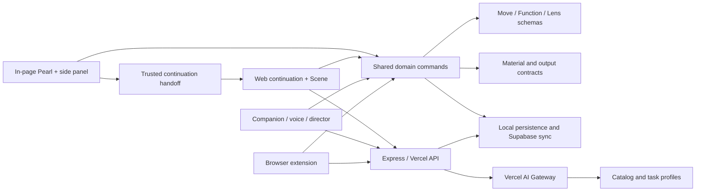

# Pearl

Pearl is an extension-first operating environment for reusable cognition. The small in-page Pearl is the everyday product: it observes only explicit material, accepts voice or direct manipulation, executes bounded capabilities, and stays with the page where the work began. The website is its continuation surface—not a download landing page or a competing blank app. It receives explicit extension handoffs when spatial arrangement, deep editing, comparison, history, durable Scenes, or larger review surfaces cannot fit safely in the original tab.

This README is the canonical product and engineering contract for the fully realized product. “Must” and “shall” describe required behavior. Optional future extensions are isolated in [Expansion roadmap](#expansion-roadmap).

## Product thesis

Most AI products make the prompt, model response, and conversation the primary unit. Pearl makes the user’s evolving way of thinking the primary unit:

- Work begins as material, not as a mandatory chat.
- Instructions become reusable objects instead of disposable prompt history.
- Processes remain editable, inspectable, composable, and versioned.
- Context is explicit and bounded instead of silently accumulating.
- Generation creates navigable alternatives rather than replacing the source.
- The spatial arrangement, transformation history, and user’s taste remain part of the artifact.
- Direct manipulation, voice, companion execution, and browser-extension execution must produce equivalent durable effects.

### Experience principles

1. **The page Pearl is primary.** A person selects material and states a goal on the page already in use; the website opens only when that work needs more room.
2. **Explicit execution.** Selecting, highlighting, queueing, or previewing never runs a model. Only explicit **GO** or an equally explicit command executes.
3. **Preserve sources.** Branching and interpretation create lineage-linked outputs; they do not silently overwrite source material.
4. **Progressive disclosure.** Common actions stay immediate. Graphs, model assignments, schemas, provenance, and advanced composition remain inspectable without crowding the default surface.
5. **One semantic system.** Web app, companion, voice, and extension share object schemas, domain commands, validation, persistence, and undo semantics.
6. **Verified agency.** The orb executes canonical commands directly and demonstrates only freshly verified effects. Ghost cursors and rays are never mutation authority.
7. **Bounded autonomy.** Plans, context, research, generation, cost, retries, and iteration are finite, cancellable, and checkpointed.
8. **Private by default.** Local work stays local unless the user signs in, exports, shares, captures a screen, or presses GO with disclosed material.
9. **Accessible equivalence.** Pointer, touch, keyboard, and voice paths reach the same core outcomes.
10. **Terminological discipline.** Move means atomic action, Function means process, and Lens means way of seeing/context everywhere.
11. **Pearl materiality.** Every surface uses depth, softness, subtle iridescence, smooth motion, layered translucency, and quiet luminosity. Decoration that does not clarify state, hierarchy, or action is removed.

## Product topology: page first, continuation second

Pearl has one product distributed across two differently constrained surfaces:

1. **The browser page is the point of origin.** The injected Pearl and side panel capture explicit selections, hold bounded context, apply Moves, Functions, and Lenses, stage candidates, accept taste feedback, and insert reviewed results without forcing a context switch.
2. **The web root is a continuation receiver.** `/` asks the trusted extension for an explicit preserved working set and shows what is ready to continue. It never makes extension download the primary display, never creates a Scene merely because someone visited, and never pretends to possess page context that was not handed off.
3. **A Scene is overflow space.** A user opens `/scene/:id` when the original page cannot contain spatial arrangement, many artifacts, branching graphs, detailed provenance, semantic orbs, version review, or Output Frames. The handoff creates source-linked Scene material and one active semantic orb through canonical commands.
4. **The library is durable memory.** `/library`, `/packages`, `/tasks`, and `/settings` organize reusable and account-level objects. They support the page Pearl; they are not the default place where work must begin.
5. **Installation is secondary setup.** `/install` remains reachable for first-time setup and store/manual installation, but it is not the home page or the product’s main visual proposition.

The continuation handshake is versioned, nonce-bound, and accepted only from exact trusted origins. It can carry the extension’s explicitly captured fragments, queued action references, active Lens reference, staged results, semantic orbs, and a requested continuation surface. The website materializes only what was explicitly preserved; browser-protected pages and unavailable extension messaging degrade to saved web Scenes and library access without fabricating a handoff.

## Core ontology

### Material

Material is the universal input and output envelope. It carries a stable ID, machine kind, MIME type, content, alternate representations, output contract, fingerprint, and provenance.

Required kinds are text, rich text, list, table, image, link, drawing, JSON, multimodal bundles, and Lens material. Deterministic bridges convert compatible representations—such as rich text to text, table to JSON, drawing to image, or text/image to multimodal. When no safe deterministic bridge exists, Lens proposes an editable bridge Move and identifies required model capabilities. Conversion never happens invisibly.

### Move

A **Move** is one atomic, reusable action:

- one instruction or prompt template;
- explicit input type and arity;
- semantic and machine-readable output specification;
- optional generation plan and model recommendation;
- stable identity, version, private examples, and provenance.

A Move can be authored directly, captured from an ordinary instruction event, inferred from examples, imported, forked, or promoted into the Primitive Moves shelf. It cannot contain process children.

### Function

A **Function** is a reusable process:

- an acyclic graph of versioned Move or Function references;
- ordered, branching, and converging edges;
- explicit selected outputs;
- optional Lens context bindings;
- invariants, model preferences, output specification, and generation plan;
- exact checkpoints after each completed node.

Functions may return one or multiple typed outputs. A Function can be captured from material lineage, assembled in the editor, composed from library objects, learned from before/after examples, or inferred from a transcript. Editing a Function creates a version; historical outputs retain the exact referenced versions.

### Lens object

A **Lens** is a reusable way of seeing and a bounded context:

- source material and relationships;
- spatial placements, layers, conflicts, and priorities;
- inclusion and privacy policy;
- context budget;
- perceptual facets that determine what to notice, ask, relate, preserve, challenge, or exclude;
- model and encoding provenance.

A Lens is context, not an action. Applying a Lens means binding it to a Move or Function, composing it with another object, or interpreting material through it. An empty Lens resets context; a rich Lens can combine evidence, a perceptual model, and composed Lens layers.

The historical primary “Generator” object must not appear in current product vocabulary. Its useful behavior—collecting emerging spatial structure and generating from it—belongs to Lens material, Lens encoding, and Lens application.

Legacy data migrates idempotently under these rules:

- an old atomic `function` becomes a Move;
- an old process/pipeline `lens` becomes a Function;
- an old contextual `generator` becomes a Lens;
- legacy `primitive` becomes `primitiveMove`;
- old commands and storage names remain read-only migration adapters, never current UI terminology.

Ambiguous records default to reversible Lens/context classification and retain source kind, aliases, migration reason, confidence, and original extension fields.

### Scene, Output Frame, node, candidate, and orb

- A **Scene** is a versioned, unbounded cognitive world carrying its explicit working set, camera, branches, checkpoints, and semantic orbs. It is never created merely by visiting the web app.
- An **Output Frame** is an optional bounded publication region inside a Scene. Legacy Pages migrate into legacy-compatible Output Frames without changing object IDs, lineage, history, or coordinates.
- A **node** is lineage-bearing AI material in a Scene. It can be moved, read, highlighted, branched, linked, or placed in an Output Frame.
- A **candidate** is one typed output in a generation batch, with its requested/resolved model, branch specification, differentiation blurb, status, provenance, and taste feedback.
- The **agent shell** is the singular companion, cursor, command, context, and execution interface. It plans, observes, executes canonical commands, verifies effects, checkpoints, confirms, and recovers.
- A **semantic orb** is a small, user-created, Scene-persistent capsule that may represent an empty emerging idea, material, selection, Move, Function, Lens, candidate, branch, query, transcript, external capture, grouped context, or Scene. Opening one mounts its working set into the agent shell; only one capsule is active at a time.
- A **worker orb** is a run-scoped read, research, or evaluation process. It returns a typed proposal to the agent shell and never becomes a persistent semantic orb unless the user explicitly promotes a verified result.

### Pearl visual and motion language

Every AI Pearl is precious because it is small: 28–36 CSS pixels at rest, with a perfectly circular silhouette and a slightly off-center nucleus. The material stack is a warm paper-adjacent interior body, an asymmetric translucent nucleus, a thin nacre layer constrained to unsaturated rose/celadon/pale-gold interference, a blurred low-opacity reflection proxy, and one small sharp softbox highlight. It gathers surrounding light; it does not emit it. Outer glows, radial “energy” rays, saturated cyan/magenta, thick borders, and decorative particle fields are prohibited. A set-down Pearl may use only a whisper of contact shadow.

Two or three internal layers move by fractions of a pixel relative to pointer position and velocity so the object reads as volume rather than a flat disc. Cursor mode uses spring lag with mass, one soft overshoot, and no teleporting. Rotation is nearly imperceptible; nacre shifts because the viewing proxy changes, not because the Pearl spins. Idle breathing is sinusoidal at ±2% over four seconds. Noticing appears as slowly warming interior translucency, never a pulse. Reduced-motion collapses every state and parallax layer to a static, fully legible composition.

The surrounding interface follows the same material logic: depth without spectacle, soft hierarchy, subtle iridescence, smooth settling, layered translucency, quiet luminosity, and aggressive removal of ornamental chrome. Paper remains paper-like; dark space remains neutral; controls appear only when they clarify a current action or state.

The Scene orb input is wired to the same companion planner, director verbs, canonical effects, persistence, and undo/redo stack as the full instrumentation view. Its **Actions** view restores the highest-value paper controls without rebuilding a permanent toolbar around the Stage: creating structured blocks; selecting, typing, and highlighting; turning a highlight into one node; saving material as a Move, Function, or Lens; learning from before/after examples or a chat; capturing lineage; organizing and fitting the paper; and exporting, sharing, touring, or adapting the workspace. Choosing a deep paper action opens the Output Frame and executes the same registered director verb used by the companion. Opening that view is an adaptive handoff, not a second implementation. The extension side panel and isolated page overlay use the same restrained state grammar at their smaller scale.

### Orb cursor, context, and workers

Triple-Space outside editable fields and controls makes the primary Pearl the literal cursor on web Scenes and ordinary extension-enabled pages. Its rendered body follows through spring physics while an invisible precision hotspot remains aligned to the real pointer, so mass never degrades native targeting. Text, action, grab, and resize targets change presentation without changing pointer semantics. Escape or a second Triple-Space sequence restores the native cursor. Cursor mode is persisted per web surface and per extension tab. Browser-protected pages, browser chrome, cross-origin frames, and pages where content scripts are prohibited retain the native cursor and offer the side-panel fallback.

Dragging material onto Pearl adds a source-preserving context object. Dragging a Lens applies an editable atmosphere with explicit strength. Both are inspectable, removable, keyboard reachable, undoable, and persisted in the active Scene working set. Dragging context back to the Stage creates a provenance-linked copy rather than moving or deleting the source. Candidate batches appear as constellations with equivalent Yes, No, and More-like-this controls.

Read, evaluation, and research work may split into bounded worker orbs. Each worker has an isolated context, model/tool budget, checkpoint, status, typed proposal, and cancellation control. Parallel mutation scopes are rejected. Completed proposals return to the parent orb, which records fusion provenance and applies nothing until verification succeeds. A cancelled or failed worker preserves the exact parent checkpoint and the surviving worker evidence.

Normal companion execution invokes capability handlers directly, emits a typed direct-effect receipt, observes the resulting state, and retains undo/checkpoint evidence. The ghost cursor is reserved for an explicit “show me” demonstration or a controlled animation test; it is not mutation authority.

### Semantic orb capsules

Inactive semantic orbs remain compact, constant-readable points on the Stage. New orbs appear at the pointer or beside their source with collision-aware placement; dense groups collapse to a counted cluster that can be revealed without changing persisted coordinates. A person can create an empty orb, turn any Stage material or external page capture into one, drag material or a Lens into it, move it, rename it, duplicate it, archive it, or use keyboard and touch equivalents.

Orb-on-orb drops always remain productive and source-preserving: **Nest** establishes reversible hierarchy, **Merge** creates a grouped-context capsule, and **Compose** creates an ordered capsule. Splitting produces lineage-linked capsules from the represented sources. Merely adding context never executes a model; execution still requires an explicit command or GO.

The authoritative record is `scene.semanticOrbs[]` plus `scene.activeSemanticOrbId` in Scene v4. Each record has a stable ID, schema version, placement, representation kind and references, working set, parent/children, lineage, provenance, and archive state. Runtime phase, live traces, candidate streams, and worker records are not serialized into semantic capsules. Canvas saves rebase onto the latest Scene snapshot so they cannot erase capsule or working-set edits.

In the extension, saved capsules appear in a compact tray beside the single 28–36-pixel page Pearl. Current page selections can become capsules or be added to the active capsule, and synced Lenses can be applied there. A capsule can be renamed, duplicated, split, unnested, archived, or explicitly deleted; context and Lens bindings remain independently removable. These controls and their companion verbs share the same operation semantics as the web commands, including scoped confirmation for deletion. Spatial multi-orb arrangement opens the authoritative web Scene because browser pages and protected surfaces cannot safely host an unrestricted world; the nonce-bound handoff preserves queued action references, active Lens reference, structured candidates, active-orb identity, and all semantic-orb payloads rather than simulating the operation.

## Primitive Moves

The primary Primitive Moves are:

- **Branch** — preserve the source and create distinct useful possibilities. Each branch may carry its own perspective, instruction, constraints, Lens bindings, model, diversity, and seed.
- **Merge** — fuse two or more explicit Material inputs into one coherent structure while retaining all source links.
- **Deepen** — surface assumptions, mechanisms, principles, and underlying structure grounded in the source.
- **Challenge** — identify weak assumptions, counterevidence, failure modes, and the strongest opposition case without destroying the source.
- **Embody** — make an abstraction concrete through examples, observable behavior, situations, and artifacts traceable to the source.

People may promote any Move to the Primitive shelf, demote a built-in, and reorder the shelf. Preferences are separate from canonical Move definitions so upgrades do not erase user organization.

Primitive defaults are editable and versioned. A user override replaces the matching canonical card without changing its stable identity, losing nested steps, or creating duplicates. Historical transforms such as Research, Compress, and Reframe remain ordinary editable Moves; migration changes their classification only where an explicit alias maps them to Branch, Merge, Deepen, Challenge, or Embody.

### Proximity Merge

Dragging one compatible item toward another reveals a non-destructive Merge preview. The preview:

1. identifies every proposed input;
2. shows the resulting placement and output contract;
3. distinguishes grouping from execution;
4. arms only after a visible 420 ms dwell inside a 72 CSS-pixel screen-space target field;
5. treats release while armed as an explicit Merge command equivalent to pressing GO;
6. disarms if the pointer leaves the 96 CSS-pixel hysteresis boundary, preventing flicker and accidental commits across workspace zoom levels;
7. preserves originals, creates a midpoint source node containing both source IDs, and runs Merge from that node;
8. offers immediate undo and refuses unreadable, incompatible, or ambiguous inputs until a bridge or explicit selection resolves them.

Mere proximity never executes, deletes, or replaces material. The visual target, dwell, and armed-release gesture are mandatory.

## Universal composition algebra

Every pair of canonical objects composes through one ordered 3×3 algebra:

- Move × Move → Function
- Move × Function → Function
- Function × Move → Function
- Function × Function → Function
- Move/Function × Lens, or Lens × Move/Function → Function with ordered context binding
- Lens × Lens → layered Lens

Composition records operand IDs and versions, left/right order, relation (`then`, `before`, `through`, `scope`, or `merge`), grouping, user intent, drag geometry, fingerprint, and whether the result is ephemeral or saved.

The user sees a preview before persistence. Action composition derives an acyclic process graph and terminal output contract. Lens composition merges perceptual models, budgets, material, privacy policy, priorities, and conflicts. A later empty Lens resets prior context layers. Multi-selection composition is a bounded left fold with a visible order and a maximum selection size.

## Universal semantic transfer

Every deliberate drop, send, save, paste, or companion transfer resolves through one versioned semantic intent contract. The resolver receives ordered source descriptors, a destination descriptor, and gesture context; it returns ranked valid intents with a default, target-specific preview, result kind, prerequisites, reversibility, and preserving fallback. MIME identifies a representation, never the limit of what the material can become. A drop never disappears, throws a generic conversion/type rejection, or silently loses the source.

The canonical fallback preserves the original as Material at the destination and offers the next valid actions. Model inference may enrich or decompose a transfer, but basic preservation and canonical creation never depend on a model call. Ambiguity opens a compact chooser only when alternatives materially differ. Permission, privacy, destructive scope, model compatibility, and cost safeguards remain explicit and proportional to risk.

The transfer grammar is:

- Exact plain, rich, selected, highlighted, transcript, history, or paper text sent to Moves creates a Move immediately. `sourceInstruction` and `promptTemplate` preserve the ordered text verbatim; a multi-step suggestion may offer a Function but never blocks the Move.
- Material sent to Functions captures real lineage when present, previews deterministic decomposition for an explicit process, or wraps the exact source in one valid Move and one-step Function. “Keep as one Move” remains available.
- Any source sent to Lenses becomes provisional bounded material immediately. Perceptual encoding is an optional follow-up.
- Move/Function/Lens object-on-object transfer uses the ordered universal 3×3 algebra. Move × Move, Function × Function, and every cross-kind pair create a Function; Lens × Lens creates a layered Lens.
- Actions sent to content or AI nodes fill the action slot; Lenses fill the context slot; explicit GO executes. Content sent to AI creates a fixed source/material node. No drop executes unexpectedly on blank paper.
- Canonical objects sent to paper materialize as portable references, text, or previews. Media and files preserve their original Material; Move execution waits for an explicit extraction instruction when no text exists.
- Multi-selection preserves fragment, item, and spatial order. Moves use editable separators, Functions capture shared/minimal lineage or ordered Moves, and Lenses retain separate materials.
- Primitive Moves accepts Move promotion/reordering; other content creates an exact Move and promotes it. Dragging out demotes without deleting.
- Archive and trash remain explicit scoped targets. Near misses never delete, and confirmed destructive transfers preserve the declared scope.

Valid destinations reveal on drag start and announce a target-specific preview before release. Hit thresholds are screen-space stable across zoom, targets use magnetic hysteresis, edge motion autoscrolls or autopans, Escape leaves the source unchanged, and safe transfers expose immediate undo. Keyboard “Send/Save/Combine with…”, touch long-press/drop, and screen-reader status use the same resolver and commands. Drag overlays never intercept text selection, center movement, edge branching, cross-layer transfer, or armed proximity Merge.

Direct manipulation, companion `semanticTransfer`, and extension capture use the same intent grammar and persisted object semantics. Companion demonstrations begin on a current source hitbox, resolve and preview the real target, release there, invoke the same command, and complete only when the matching state effect exists. Unsupported external spatial editing preserves a handoff payload for the web editor instead of rejecting it.

## Spatial workspace

### One unbounded Scene, optional bounded Frames

The canonical overflow workspace is a versioned, unbounded Scene with one camera, one selection system, and one persistence envelope for working material, AI nodes, relationships, context, Lenses, candidates, branches, checkpoints, and Pearl instances. Visiting the web root does not create a Scene. A Scene appears only after an explicit New Scene action or an explicit extension continuation handoff; the latter preserves captured source IDs/provenance and mounts the carried working set into one active semantic orb.

An Output Frame is an optional 8.5×11-inch publication region at 96 DPI (768×1104 world units) with a 24-unit content margin. Only objects and nodes carrying that Frame’s `frameId` are clamped to its bounds. Oversized Frame-local objects scale to fit; strokes retain shape; text width is bounded; nodes retain their full footprint. Scene-local material without a `frameId` remains unbounded.

Every legacy Page migrates idempotently into its own Scene and legacy-compatible Output Frame. Stable IDs, page IDs, coordinates, lineage, histories, camera state, and unknown future fields are retained. Version-4 Scene persistence is authoritative while legacy item, node, page, camera, and version-3 unified stores remain dual-written/readable during the compatibility window.

### Layers and domains

The page supports interoperable domains:

- paper text and blocks;
- images, links, voice/video references, diagrams, and drawings;
- pen, marker, and highlighter ink;
- AI source, result, process, and session nodes;
- relationships and arrows;
- Lens material and composition previews;
- transient selections, lasso, brush queues, ghost cursor, and job overlays.

Transient UI is never serialized as content. Domain routing is deterministic: drawing tools draw; eraser erases; highlighter marks; Alt/Option or empty-space drag pans; Shift-drag lassos; a node center moves/opens; a node edge branches; paper objects move; an empty click creates text.

### Paper interaction

Users can:

- click to create editable text;
- paste or drop supported material;
- add sticky notes, voice notes, images, diagrams, equations, tables, code blocks, video references, and typed callouts;
- draw pressure-aware pen and marker strokes;
- create visible highlighter marks;
- select, lasso, multi-select, move, resize, rotate, group, link, duplicate, and delete;
- add structured blocks;
- undo and redo edits;
- move material between paper and AI while preserving provenance;
- inspect item stages and exact transformation history;
- fit the page, zoom to an item, and return to the full sheet.

Dragging must preserve the pointer’s grab offset at every zoom. Touch targets are at least 24 CSS pixels and gestures cannot create accidental nodes.

### AI nodes, arrows, and zoom morph

Every node stores its kind, content, source IDs, source-node IDs, parent, operation, output specification, candidate and model provenance, position, radius, loading/error state, and history.

Required behavior:

- New nodes appear near the intended pointer direction, collision-adjusted while preserving directional meaning.
- Children fan around parents; dense constellations resolve overlaps without breaking lineage.
- Curved arrows attach to the visible silhouette, point radially into the target, separate sibling strands, and show operation labels on hover.
- At distant zoom, nodes are compact cells with stable screen hit targets.
- During zoom, a node continuously morphs from circle to readable card; text and ring share one silhouette.
- Clicking or double-clicking enters reading focus with the complete output, provenance, and fragment selection.
- Returning restores constellation context.
- The center of a node always moves it. Dragging from its edge opens a hierarchical chooser: Primitive Moves, Moves, then Functions.
- Pointer direction chooses branch placement; arrow keys change level/choice, number keys choose, Enter/Space applies, and Escape cancels.
- Branching never mutates the source node. Indefinitely extensible branching is user-driven across batches, while each batch enforces candidate, parallelism, latency, cost, and nesting limits.

## Cross-domain highlighter and brush

The highlighter is an operation surface, not decoration. It can mark complete paper items, exact text fragments, AI nodes, exact phrases inside AI outputs, and library cards.

### Selection contract

- Marks remain visible until cleared or committed.
- The living selection reports counts by domain.
- A mark can be dragged separately after it is created; initial marking never becomes an accidental transfer.
- Exact fragment identity survives wrapping, zoom, reading focus, and transfer.
- Mixed selections retain per-source provenance.
- “Make node” creates one combined source node.
- “Send to AI” creates source-linked AI material.
- “Find sameness” requires multiple inputs and produces a grounded shared-structure result.
- “Save as Lens” collects the bounded selection into Lens material.

### Brush and explicit GO

A Move/Function queue and Lens-context stack can be armed from the rail, selection toolbar, companion, or extension:

1. Select or highlight explicit material.
2. Add ordered action objects and Lens context.
3. Reorder or remove entries.
4. Resolve whether ambiguous Lens material is source collection or context.
5. Preview the exact stack, input count, output count, bridges, cost policy, and validation errors.
6. Optionally save the action queue as a Function.
7. Press **GO** or Command/Control+Enter.

Queueing does not execute. Lens context alone does not execute. GO is shown only when at least one action and valid material exist. Escape first disarms the pending stack, then clears marks. A successful run executes once under an idempotency key, preserves sources, creates typed outputs, and clears only the committed transient state. Failure retains material and queue for correction or retry.

## Generation and taste navigation

### Output specifications

Every Move and Function has an output specification:

- semantic type;
- machine kind: text, rich text, list, table, image, link, material, or multi;
- description and exact instructions;
- optional JSON schema;
- minimum/maximum cardinality;
- stable branch IDs and labels for multiple outputs.

Function output specifications derive from terminal graph leaves unless explicitly overridden. Multi-output Functions return separately typed outputs in exact order, never a flattened prose blob. Every output carries branch, terminal, run, lineage, and Lens-context provenance.

### Generation plans

Moves and Functions persist versioned generation defaults:

- candidate count;
- automatic, single-model, exact-slot, weighted-group, or compare assignment;
- branch-specific specifications;
- temperature, diversity, and seed;
- parallelism;
- maximum cost and latency;
- structural-output variants;
- stop policy;
- “more like this” strategy.

Each branch specification contains a stable ID/order, name, instruction, perspective, constraints, requested model, optional output override, Lens bindings, diversity, seed, provider options, count, and group.

The Function editor exposes every BranchSpec directly. Users can add up to 20 branch perspectives, rename them, edit instructions, select a compatible model independently for each branch, reorder, duplicate, or remove them, and retain at least one branch. Changing candidate count preserves existing specifications by stable ID and creates deterministic defaults only for new slots. A branch count greater than one expands that specification into sibling candidates without losing the shared branch identity.

### Candidates and comparison

Starting a batch creates all candidate placeholders before model calls. Each candidate independently transitions through pending, running, streaming, completed, failed, or cancelled.

Every candidate must display:

- a unique **3–8 word differentiation blurb** explaining how it differs from siblings;
- requested and resolved model;
- provider route and fallback marker;
- streamed content and typed result;
- cost/usage and latency when available;
- source and parent candidate;
- private taste decision and reason.

Blurbs are comparative, sibling-aware, non-duplicative, and about substantive differences—not generic quality claims.

### Taste branching

The user can accept, reject, or leave a candidate undecided, add a private reason, and explicitly choose whether feedback should be remembered. Focus advances through undecided siblings.

Taste controls also support **Keep all**, **Extend selected**, **Stop generation**, and **Retry candidate**:

- Keep all accepts every recoverable sibling while keeping the feedback private and unpublished.
- Extend selected starts one bounded child batch from each explicitly selected candidate, including candidates from different parent branches.
- Stop generation cancels only pending/running siblings and preserves every completed candidate.
- Retry candidate reruns only the focused failed candidate under a new idempotent attempt and retains its parent/branch lineage.

“More like this” may start from one or several accepted candidates across different branches. The next plan carries:

- positive exemplars from chosen branches;
- bounded negative examples and rejection reasons;
- explicit properties to preserve and change;
- inherited or newly selected models;
- a new finite candidate/cost/latency budget;
- parent links to every contributing candidate.

The user can repeat this indefinitely as a lineage of bounded batches. Cancellation stops remaining work without deleting completed candidates. When some candidates fail, successful outputs and exact retry checkpoints remain intact.

## Lens system

### Perceptual schema

A Lens perceptual model contains ordered, individually enabled facets in:

- notice;
- questions;
- relationships;
- concepts;
- assumptions;
- evidence standards;
- scales;
- transformations;
- tensions;
- blind spots;
- counter-Lenses and falsifiers;
- preserve/exclude rules.

Each facet has stable identity, definition, priority, confidence, review state, evidence references, and origin. User-edited sections are protected from later inference unless explicitly replaced.

### Creating and encoding Lenses

Any explicit bounded material can become Lens evidence: paper objects, spatial arrangements, drawings, images, AI nodes, paths, Functions, transcripts, before/after examples, imported context, visible-screen observations, or external web selections.

The flow is:

1. collect material without inference;
2. inspect included/excluded sources and privacy policy;
3. choose empty, bounded, or rich context;
4. encode a provisional perceptual model with a compatible model;
5. review confidence, ambiguity, alternatives, source references, and diff;
6. edit facets and protect user-authored sections;
7. save a version.

Encoding never grants permission to unrelated local or screen data.

### Empty New Chat Lens

**New Chat** is an empty, zero-budget Lens. It contains no source material, excludes private carryover, and resets earlier composed context. It provides a fresh isolated model context without creating a second conversational product model.

### Applying and composing context

Context compilation:

- sorts Lenses by priority;
- lets an empty Lens reset earlier layers;
- emits enabled perceptual facets before source material;
- excludes sensitive and non-consented private material;
- clips deterministically to the smallest applicable context budget;
- records exclusions, truncation, conflicts, sources, enabled facets, and a fingerprint.

Conflicting Lens values remain visible. Lens × Lens composition preserves layers and conflict policy; it does not silently blend incompatible instructions.

### Spatial and symbolic Lens authoring

A Lens may be authored as a spatial surface rather than a form. Users place text, notes, images, drawings, and a hand-drawn glyph; preserve relative placement and grouping; and ask Lens to identify the recurring structure expressed by those elements.

The editor provides an immediate deterministic structural reading, then optionally enriches it with a model. The review exposes:

- underlying meaning and recurring pattern;
- the contribution of each element;
- a reusable “view through this structure” instruction;
- object roles, glyph description, and source sample;
- local heuristic versus model-derived fields.

Model enrichment fills gaps and never overwrites user-customized interpretation. Saving produces normal Lens material and a perceptual model, not a separate Symbol or Generator object. Reapplication preserves the structural pattern while rebinding content.

## Learning reusable cognition

### Capture from ordinary use

Every user-owned instruction can create a private instruction event containing exact text, role, input/output references, requirements, output spec, model provenance, Lens fingerprint, result status, source surface, and time.

The user may save that event as a Move. System/private context cannot be captured. Assistant output or unknown-role text requires choosing between “use this text as instruction” and “infer the Move that produced it.” Failed/cancelled runs can be saved only with a visible warning. Equivalent instructions deduplicate by normalized fingerprint. Repeated successful instructions can prompt a non-blocking “save as Move” suggestion.

### Before → after learning

Users can provide one or more ordered examples containing text, PNG/JPEG/WebP images, pressure-aware drawings, referenced workspace objects, mixed modalities, and counterexamples.

The system validates size and completeness, sends only explicit examples, and infers:

- the reusable operation;
- name and summary;
- invariants and changes;
- confidence and ambiguity;
- plausible alternatives;
- input requirements and output specification.

The result is an editable preview. Users may select an alternative, add disambiguating examples, re-infer, then save an atomic Move or a multi-step Function according to the inferred structure. Examples remain private by default and survive retry/cancellation.

### Transcript learning

Users paste or explicitly select a transcript, choose Move, Function, Lens, or all three, exclude messages, redact text, and run inference.

The system:

- parses roles without treating system/private context as user intent;
- extracts repeated atomic instructions into Moves;
- extracts ordered/branching workflows into Functions;
- extracts durable context and perceptual stance into Lenses;
- provides alternatives and editable previews;
- validates references before saving;
- saves all selected artifacts atomically and deduplicates repeated imports.

No passive conversation scraping is allowed.

### Example cultivation and Function forging

Users may deliberately cultivate a Move or Function from kept input→output examples gathered during ordinary work. The workshop supports positive and negative examples, domain labels, why-the-user-kept-it notes, source item/node/history references, reorder/remove, explicit rules, constraints, failure modes, and test cases.

Compilation:

- requires at least two complete examples;
- redacts credential-shaped strings;
- selects examples within a visible token budget and reports omissions;
- generalizes behavior rather than memorizing subject vocabulary;
- creates an editable proposal and version snapshot;
- provides a manual skeleton when model compilation is unavailable;
- tests a holdout or all examples and labels deterministic overlap as overlap—not as a quality score;
- saves the reviewed result as an atomic Move or structured Function with private example provenance.

The companion can add, remove, reorder, compile, test, refine, shape, and save through the same workshop actions. Undo restores the previous draft/proposal version.

### Voice, drawing, and sketch learning

The paper can record voice and drawing together after one explicit microphone action. A recording session timestamps speech segments, stroke points, created items, and waveform level. Strokes are associated with overlapping speech segments so spatial marks and spoken explanation form one multimodal sketch bundle.

Stopping:

- stops recognition, recorder, audio tracks, animation frames, and audio context;
- preserves transcript, segment timing, stroke/item IDs, annotations, and paper size;
- exposes audio retention separately from the derived transcript and geometry;
- allows the bundle to become Lens evidence, Move/Function learning evidence, or interpreted material.

Microphone denial leaves paper editing intact. Speech recognition is optional; drawing-only bundles remain valid. Raw audio is local and ephemeral unless the user explicitly saves or exports it.

### Portable cognition and cross-domain transfer

Moves, Functions, Lenses, journeys, and spatial patterns can carry a portable cognitive-transfer record. It separates:

- domain-invariant operation, phase grammar, input/output shape, and relational pattern;
- source-domain exemplars and slot roles;
- abstract Move references and process tree;
- fidelity constraints and checksums;
- optional glyph and material template.

“Explore elsewhere” shows the learned domain, current inferred domain, cognitive phases, output shape, and suggested target domains. Testing rebinds exemplar slots to explicit target material. Applying in the source domain restores fidelity anchors; applying cross-domain adapts the invariant pattern. Deterministic structural fallback remains available when model enrichment is unavailable. Sharing preserves transfer metadata without copying private source text or prompt internals.

### Role-guided Function architecture

The companion may use an explicitly supplied role—such as investor, founder, researcher, or writer—to propose deep Function trees. These are editable starting points, never hidden identity-based automation.

Complex deliverables use named cognitive phases, meaningful nested structure, at most one verified-research leaf when factual grounding is required, and a final polished deliverable leaf. Internal subject-resolution metadata is runtime-only and must never appear as a user-facing output. A user can inspect, replace, flatten, branch, or delete every generated step.

Function quality rules require action-oriented 3–7 word phase names, one-sentence sparse-input→deliverable descriptions, precise leaf prompts with one output shape, and polished sectioned final outputs. If execution leaks entity/search metadata instead of a deliverable, Lens detects it and routes the draft through a visible deliverable-rewrite step rather than presenting internals.

## Library, history, and sharing

The library provides searchable, filterable, bounded rendering across Moves, Functions, and Lenses. Records include stable ID, version, type, tags, domains, component names, output contract, step/output counts, pin/archive state, collections, usage, recency, sharing, forks, and content hash.

Users can:

- search by name, description, tags, domains, and components;
- filter pinned, archived, collection, type, shared, or forked objects;
- sort by recency, name, frequency, or version;
- pin, archive, restore, fork, merge, and inspect dependencies/dependents;
- edit by direct form or instruction;
- preview composition before saving;
- retain immutable historical versions.

Every paper item, node, candidate, and generated artifact keeps transformation lineage. History supports stage inspection, path walking, branching from a prior stage, undo, and exact replay when referenced versions and model availability permit.

### Cognitive version control

Object evolution uses repository-like semantics without exposing source-control jargon as a prerequisite:

- every save records a message, ordered step checksum, parent, kind, and time;
- versions may branch, fork, and merge while retaining lineage breadcrumbs;
- Function diffs align step-name sequences and show shared, removed, and added phases;
- merge previews identify structural conflicts before creating a new version;
- historical versions remain executable and shareable by exact reference.

The interface labels the current Function, branch/fork/merge relationship, save count, and lineage. “Commit” means save a new cognitive-object version; it never writes to the software repository.

### Cognitive packages and trust

A Cognitive Package is a declarative, versioned bundle of Moves, Functions, Lenses, and their dependency closure. Its canonical manifest records namespace/name, semantic version, immutable content hash, artifact versions and contracts, required models/modalities, permissions/connectors, provenance, license/visibility, test evidence, scan results, migration notes, author public key, and Ed25519 signature. Arbitrary executable code, unsafe keys, undeclared connectors, and hidden model calls are rejected.

The lifecycle is `draft → validate → test/evaluate → dependency/privacy/security scan → semantic review → sign → publish → install/update/deprecate/rollback`. Private signing keys are non-extractable and never stored in localStorage or package records. Publish and deprecate are idempotent external writes with scoped approval receipts. Install re-verifies canonical content, signature, key status, permissions, and deterministic dependency resolution before one atomic storage change; a failed write restores the prior install set.

Authenticated package records and key status use versioned server migrations, account/team row-level isolation, immutable published versions, bounded pagination, and revocation. A bounded local registry is the offline/anonymous fallback. Anonymous authors may create and export self-signed local packages; account publication remains an explicit authentication boundary. Web and extension trust cards show identity level, signature, provenance, tests, requested access, model/cost requirements, dependency health, update history, and deprecation replacement.

### Higher-order artifacts and reviewable patches

Moves, Functions, and Lenses may be passed as immutable typed `ArtifactRef` values containing stable ID/version/kind, contracts, graph/context summary, authorized editable scope, snapshot, and fingerprint. A higher-order operation produces a new artifact, alternatives, or an `ArtifactPatch`; it never invisibly mutates the source.

Patches expose graph, content, contract, dependency, context, model/cost, privacy, and layout hunks. Protected registries cannot be targets. Recursion depth, operation count, model calls, and cost are bounded. Candidates run against fixtures and holdouts in isolated snapshots. Users may accept all or selected hunks; accepted changes create a new version, while originals and pinned dependents remain stable until an explicit migration is approved.

### Personal command vocabulary

An explicitly taught phrase becomes a versioned `PersonalCommandDefinition` containing exact/semantic trigger variants, parameter slots, canonical command or typed plan target, scope, precedence, inherited risk, status/expiry, teaching provenance, tests, and last-use metadata. Exact aliases resolve deterministically before open-ended planning. Semantic aliases require a confidence threshold; consequential ambiguity previews or asks.

Persistent workspace/account/team teaching requires a concise executable preview and confirmation. Session-only low-risk teaching is reversible immediately. Quoted or literal uses never execute. Reserved confirmations, collisions, recursive aliases, and cycles are rejected. The vocabulary manager can inspect, test, edit, reorder, enable/disable, export/import, and forget definitions. Conflict-aware version merging keeps extension and web resolution aligned, and vocabulary remains private unless explicitly included in an export.

### Cognitive pull requests

A Cognitive Pull Request preserves source Material, fingerprint, privacy scope, requested kinds, strategy/budget, grounded candidates, evidence spans, confidence/ambiguity, novelty/duplicate matches, dependencies, review comments, tests, saturation, status, and merge receipt. “All possible” means diverse evidence-grounded coverage within a stated budget, with saturation reached after repeated rounds yield no new category; it never claims mathematical exhaustiveness.

Move candidates are atomic, Function candidates are process-structured, and Lens candidates are perceptual/contextual. Unsupported candidates without source evidence are omitted. Review exposes source versus proposal, candidate and hunk decisions, edits, comments, tests, alternatives, novelty, and coverage. Only accepted selections merge atomically as new IDs/versions with provenance and an undo receipt. Explicit extension selection may create a preserved proposal handoff; whole-page capture is never implicit.

### Ideas, worlds, and paths

The workspace provides a chronological ideas feed grouped by today, yesterday, and this week. Text, notes, voice, callouts, diagrams, tables, code, math, video, images, and sketches receive readable titles/icons and can be focused from the feed.

Users may assign explicit “world” tags (for example life, startup, writing, or philosophy), filter the page by world, and return to all material without moving or deleting hidden items. Worlds are user-editable organizational metadata, not separate storage silos.

Lineage paths can be shared and walked one step at a time. Recipients can annotate a step, branch from it, materialize the path in AI space, or leave without altering the original bundle.

### Import and export

Library bundles are versioned, size/depth/count bounded, plain-data-only, and SHA-256 checksummed. Exports include dependency closure, composition metadata, rack metadata, collections, Lens structure, and user-owned material.

By default exports exclude credentials, board-sync metadata, companion memory, private grind/before-after examples, raw page captures, and source provenance. Private sources require separate explicit opt-in.

Import validates schema, checksum, unsafe keys, duplicate IDs, dependency closure, and supported versions. It previews new, exact duplicate, version update, and ID conflict outcomes. Users may add, replace, skip, or keep both. Remapping updates every dependency. Repeated import is idempotent.

### Sharing

Versioned share bundles support canonical objects, journeys, paper paths, and AI paths. Small bundles use query parameters; larger bundles use URL fragments so the payload is not sent as an HTTP request path. Recipients preview the object, dependencies, destination, privacy, and use cases before materialization. Malformed or unsupported shares do not mutate local state.

## Companion and voice director

### Command contract

The companion is a complete alternate command interface for every meaningful direct action. Each capability declares:

- canonical name and typed argument schema;
- domains and purpose;
- observation requirements;
- risk/destructive state and confirmation policy;
- undo/checkpoint behavior;
- expected effect evidence;
- representative intent and test identity.

The registry, planner, runtime handlers, extension verbs, and effect tests must remain in parity. If a capability cannot be automated safely, the companion states the exact boundary and provides the safest reachable fallback.

The pre-expansion parity checkpoint was **198 executable capabilities**: **164 app/director effects** and **34 extension effects**. The current canonical baseline is **206 executable capabilities**: **170 app/director effects** and **36 extension effects**, adding grounded creative proposal, first-class Taste Lens judgment, and explicit-selection extension handoff. A registry entry is not sufficient by itself; every capability must resolve to a callable handler, execute against seeded production-shaped state, produce its declared observable effect or precise safe blocker, and remain represented in the owning feature contract. Adding or removing a capability requires updating this baseline and regenerating the effect matrix.

`CompanionCapabilityGraph` is the generated, versioned self-description of that surface. Its nodes join the manifest to canonical domain commands and feature contracts, adding stable IDs, typed inputs/outputs, observations, risk/approval/autonomy policy, cost/network boundaries, persistence, undo/compensation, surfaces, expected effects, and test identities. Generated dataflow edges connect compatible outputs to typed reference inputs and mark write conflicts and parallel safety. Exact and bounded semantic retrieval select only goal-relevant nodes for each planning pass; the full catalog is never inserted into every adaptive prompt. The release gate validates the graph and rejects a stale generated graph artifact.

Read-only graph APIs list and search capabilities, inspect one capability and its limits, and recommend a bounded workflow. An unmatched goal returns the precise missing canonical prerequisite and may propose a reviewable Move, Function, Lens, declarative package, or connector specification; it never invents a verb or reports an unobserved effect.

### Interaction model

- Text and voice use the same normalized intent and planner.
- Common, high-confidence commands execute immediately.
- Complex requests compile into a finite visual plan of query, action, sequence, parallel, conditional, and bounded iteration nodes.
- Every capability and argument validates before execution.
- Queries operate on a live scoped index and save stable object/version citations for later steps.
- Created resources resolve by actual IDs, not guessed names.
- The plan remains cancellable and checkpoints after every durable effect.
- Executable commands begin real ghost-cursor/director animation immediately and emit no conversational praise or redundant narration.
- Text appears only for destructive confirmation, required choice, or precise blocker.
- Speech output is off unless explicitly enabled.
- Vague requests such as “show me what you can do” run a reversible demonstration chosen for the current workspace instead of inventing or deleting user work.
- Deterministic high-value intents—Function creation, parallel branch setup, taste navigation, learning, and administration—run through typed scripts before open-ended planning.

### Modes, goals, and approval

Every request enters an immutable Goal Envelope containing the raw wording, outcomes, constraints, references, unknowns, acceptance criteria, preservation and prohibited effects, risk/cost budget, and communication policy. The companion recommends a mode from risk and uncertainty while preserving the user’s override:

- **Ask** retrieves and explains authorized context but cannot mutate.
- **Plan** retrieves live context and creates an editable typed plan; every mutation is blocked until Accept. Edit invalidates affected descendants, and Reject performs zero mutation.
- **Agent** executes approved or low-risk reversible local commands within the declared budget.
- **Debug** records multiple hypotheses, reproduces and instruments the behavior, chooses an evidence-backed cause, applies the smallest versioned fix, reruns regressions, and removes temporary instrumentation.

Mode permission is enforced at the executor boundary. Broad migrations, costly generation, and privacy changes require a scoped preview. Destructive, publishing, external-write, and secret-bearing operations always require explicit scoped approval regardless of mode. Cosmetic ambiguity takes a reversible default; the companion asks only when a choice materially changes consequential results.

### Transaction, verification, and semantic review

Typed plans support phases, todos, queries, actions, assertions, postconditions, transaction groups, specialist workers, exact migration sets, approval gates, and compensation. Before each mutating phase Lens captures an immutable workspace snapshot containing content, stable IDs, graph topology, versions, lineage, selection, and layout. The run ledger persists dependencies, status, attempts, values, evidence, approvals, errors, checkpoint IDs, worker state, and executor resume state after every transition. Reload resumes incomplete work without replaying completed non-idempotent steps.

Handler return is not success. Lens refreshes the relevant observation after each command or transaction and compares actual state with declared postconditions. Results are `verified`, `partially_verified`, or `failed`, with unintended effects. Missing intended effects block completion; unintended deletion restores the checkpoint before recovery chooses refresh/rebind, retry, compensate, replan, clarify, or block.

Plan and outcome review use a semantic diff of content, graph/branch topology, output contracts and Generation Plans, Lens context, references/dependencies/migrations, layout, and provenance/privacy metadata. Evidence rows expand to command, stable target, arguments, expected effect, observed effect, tests, and animation. Object-, branch-, and phase-scoped rejection restores the corresponding checkpoint. Normal successful operation remains terse.

### Evaluation, workers, and continuity

The Function test bench performs structural and dependency validation, versioned fixtures, unrelated holdouts, compatibility checks, normalized model comparison, browser/extension flows, and rubric evaluation. Evaluation follows `execute → observe → test acceptance criteria → diagnose → revise → rerun` within finite budgets.

Explore, Research, Evaluator, Visual Auditor, Migration Analyst, and Privacy Reviewer workers receive bounded isolated contexts. Only independent read/evaluation branches run concurrently. A mutating worker requires an isolated candidate snapshot, overlapping stable-object mutation is rejected, cancellation and budgets propagate, and the parent verifies every proposal before merge. Compact worker cards retain task, status, model, duration, blocker, and artifact without flooding the parent context.

Long sessions compact into an evidence-preserving summary containing stable IDs, unresolved requirements, decisions, approvals, failures, checkpoints, external receipts, prohibited effects, and the current task graph. Resume trusts the durable ledger and snapshots rather than prose memory. Rules resolve deterministically with security and team policy above workspace and user preferences; progressively loaded skills define reusable workflows; typed hooks may allow, deny, require approval, annotate, or trigger one bounded follow-up around commands, model calls, external writes, checkpoints, compaction, and completion.

### Voice

Voice sessions handle interim and final recognition, semantic repair, duplicate final suppression, interruption, cancellation, and one dispatch per utterance. Microphone permission is requested only on explicit activation. Raw audio is not retained by default.

The companion’s onboarding interview gathers only useful role, vocabulary, preferences, and autonomy boundaries. Administrative commands interrupt onboarding and are never misclassified as identity. Memory is inspectable, editable, account-scoped, adoptable from anonymous use, and clearable.

### Observation and understanding

With explicit scope the companion can understand:

- selected objects;
- full paper structure and relationships;
- visible viewport;
- AI graph, clusters, history, and library;
- extension page selections;
- a user-authorized visible-tab screenshot.

Observations include stable source/version IDs, revision/fingerprint, viewport, redactions, and consent scope. Exact name/tag/content, semantic Material, graph/dependency/version, and spatial/temporal indexes cover selection, viewport, paper, AI graph, library, and history. Every claim exposes an inspectable citation. Private or ignored material remains excluded unless the authorized scope explicitly includes it. Screen interpretation is grounded to supplied objects or pixels. A stale or deleted target is refreshed/rebound or blocked before mutation.

### Critique and research

Critique mode targets explicit items/candidates, ingests typed or spoken clauses, normalizes them into linked annotations, and materializes resulting edits or feedback. It cannot claim evaluation without an artifact effect.

Research uses a provider-neutral, read-only browsing contract restricted to approved HTTPS provider and source origins. Every source preserves title, URL, publisher, publication date when available, retrieval time, snippet, and claim references. `RESEARCH_PROVIDER_URL`, `RESEARCH_APPROVED_PROVIDER_ORIGINS`, and `RESEARCH_ALLOWED_SOURCE_ORIGINS` configure production access; provider credentials remain server-side. If verified browsing is unavailable or returns unverifiable metadata, research stops before mutation and says so. Model prior knowledge is never represented as live research. External publishing uses a separate connector, exact redaction/scope preview, explicit approval, and idempotent receipt.

### Taste and judgment Lenses

Taste remains one canonical Lens purpose, `taste/judgment`; it is never a separate opaque Taste object and never an executable action. The versioned perceptual model exposes domains/scopes, weighted dimensions, preferences, anti-patterns, preserve rules, exceptions, positive/negative and paired examples, critiques, candidate preferences, vocabulary patterns, confidence, evidence, review state, expiry, privacy, context budget, and priority. Facets remain editable, orderable, enabled/disabled, confirmable/rejectable, source-linked, and versioned.

Explicit “save” or “remember” teaching previews a semantic Lens diff before persistence and returns an undo receipt. Ordinary candidate yes/no remains session-private. “Looks AI generated” is represented only as editable observable anti-pattern hypotheses—never a perfect authorship detector. Before/after pairs retain private artifact references and propose low-confidence facets without overwriting confirmed user rules. Public export and packages omit raw private examples by default.

The compiler emits a bounded structured judgment envelope with Lens ID/version/fingerprint, enabled facets, priorities, preserve constraints, evidence refs, run overrides, and source policy. Evaluation materializes linked rubric evidence and proposes a separate preserve-original revision Function; it does not reduce taste to an unsupported scalar. A run-specific instruction such as “keep the author’s unusual rhythm” remains transient unless explicitly saved. Lens merges surface preference conflicts rather than silently averaging perspectives.

Research-grounded historical or persona Lenses retain sourced facts separately from inferred judgments and never claim official authorship or endorsement. Creative synthesis may evaluate alternatives through a user-selected Taste Lens while preserving contradictory candidates. Extension teaching is limited to explicit selection, stores private-example intent, and hands full review to the web editor without collecting the full page.

### Confirmations, recovery, and undo

Destructive actions show exact affected domains and counts, preserve built-ins unless explicitly included, and require an unambiguous confirmation. The confirmation is a non-modal companion popover: it cannot be dismissed by an accidental backdrop click, it does not block a new safe command, and it remains keyboard/screen-reader operable. Follow-ups may refine a pending request, while unrelated work sets the stale confirmation aside and records that decision.

Every command receives a durable bounded ledger entry with raw input, parsed arguments, plan, confirmation, effects, checkpoint, failure, and retry relationship. “Retry” resumes the last recoverable command from validated state. Errors shown to users are actionable and redact internals. Undo restores the exact pre-command checkpoint or executes the capability’s declared inverse.

## Model gateway and generation infrastructure

Vercel AI Gateway is the canonical provider abstraction. Server code owns credentials and model calls; clients never receive provider secrets.

### Authentication and model catalog

- Local/self-hosted gateway access uses `AI_GATEWAY_API_KEY`.
- Vercel deployments may use automatically injected `VERCEL_OIDC_TOKEN`.
- The live catalog is fetched from the Gateway, normalized, cached, and marked stale when fallback catalog data is used.
- Explicit model IDs validate against current availability and task capabilities.
- `Auto` chooses a compatible preferred model, then an available model according to profile quality/cost policy.

Task profiles cover companion planning, voice repair, critique extraction, Move execution, Function execution, Lens interpretation/encoding, workspace vision, before/after inference, transcript extraction, and lightweight naming. Each profile specifies required capabilities, context policy, latency/cost tier, and hard input/output/cost budgets.

Optional per-profile environment preferences:

- `AI_GATEWAY_MODEL`
- `AI_GATEWAY_MODEL_MOVE`
- `AI_GATEWAY_MODEL_FUNCTION`
- `AI_GATEWAY_MODEL_LENS`
- `AI_GATEWAY_MODEL_LENS_ENCODING`
- `AI_GATEWAY_MODEL_WORKSPACE_VISION`
- `AI_GATEWAY_MODEL_VISION`
- `AI_GATEWAY_MODEL_COMPANION`
- `AI_GATEWAY_MODEL_VOICE_REPAIR`
- `AI_GATEWAY_MODEL_CRITIQUE`
- `AI_GATEWAY_MODEL_TRANSCRIPT`
- `AI_GATEWAY_MODEL_LIGHTWEIGHT`

### Routing, fallback, and provenance

Requests validate context size, output tokens, estimated cost, required capabilities, cancellation, timeout, structured schema, tools, and reasoning effort. Retryable gateway failures receive a small bounded retry policy.

Direct Hugging Face compatibility fallback is permitted only when all are true:

1. `MODEL_GATEWAY_ALLOW_DIRECT_FALLBACK=true`;
2. `HF_TOKEN` or `HUGGINGFACE_API_KEY` exists;
3. the task profile allows fallback.

Optional fallback variables are `HF_MODEL`, `HF_VISION_MODEL`, and `HF_PROVIDER`. Fallback is never described as Gateway execution.

Every response records profile/version, requested and resolved model, gateway/adapter, provider route, fallback and reason, latency, generation ID, token usage, and cost when supplied. Streaming, tool calls, structured output, and cancellation preserve the same provenance.

## Accounts, persistence, and sync

Pearl is anonymous-first. Without account configuration, the complete local workspace remains usable.

### Local state

Canonical local persistence includes:

- page items/pages/title/star/theme/camera;
- versioned library objects and Primitive Move preferences;
- unified workspace and AI nodes;
- item history and paths;
- Lens material and perceptual state;
- rack metadata and learning drafts;
- companion memory and command ledger;
- transient extension session state in browser session storage.

Writes are immutable at the domain-command boundary and atomic at persistence boundaries. Corrupt entries fail closed or fall back to recoverable prior keys; migrations retain legacy sources for recovery.

### Supabase accounts

Optional Supabase configuration uses:

- client: `VITE_SUPABASE_URL`, `VITE_SUPABASE_PUBLISHABLE_KEY`;
- server: `SUPABASE_URL`, `SUPABASE_SECRET_KEY`;
- policy: `SUPABASE_REQUIRE_AUTH`.

Accounts support email/password sign-up, email confirmation, reset, profile display name, and server-owned plan/subscription display. Row-level security restricts profiles, board snapshots, extension artifacts, and extension-generated items to their owner. Clients cannot write plans or subscriptions.

No subscription row means Free. The newest active/trialing recognized subscription determines the displayed paid plan. Unknown plan IDs or states display no misleading Free badge; billing state remains indeterminate until the server resolves it. Plan rows are ordered server-side and prices are display data, not client authorization.

### Adoption and synchronization

On sign-in, Pearl compares anonymous/local and account snapshots:

- if the account is empty, local work is adopted;
- if local work adds distinct content, the user chooses remote, merge, or local;
- if content is already contained, it merges silently and idempotently;
- newest-wins applies only after ownership and containment checks;
- operators, Lenses, repos, references, rack metadata, and histories deduplicate without losing stable IDs.

Cloud saves are debounced and flushed when the page hides. Failure leaves the local cache authoritative and retryable. In-flight model jobs and private transient selections do not sync unless explicitly materialized.

## Pearl browser extension

The extension is Pearl’s primary surface. It brings capture, queue, GO, result, library, learning, critique, semantic-orb, and companion semantics to the web page where the user’s source material already lives.

### Capture and execution

1. The user invokes Pearl by the in-page object, extension action, context menu, or `Alt+Shift+L`.
2. The extension requests per-site access only when needed.
3. The highlighter captures only explicit native selections and renders persistent overlays in an isolated open shadow root.
4. Raw fragments, queue, tokens, and staged results live in session storage.
5. The side panel shows source origins, character disclosure, ordered actions, Lens context, generation plan, and preview.
6. GO sends only disclosed fragments and selected object references under an idempotency key.
7. Results remain staged until Copy, Insert, Replace, Annotate, Continue in Pearl, or Save is explicit.

Navigation clears page-bound raw material. Active runs can be cancelled. Anonymous libraries remain local and merge after later sign-in.

### Result insertion

Generic textarea/contenteditable insertion uses a revision snapshot and refuses replacement if the target changed. HTML is sanitized. Adapter behavior:

- Gmail targets the semantic compose body and preserves surrounding content.
- Notion supports current-block plain text and refuses cross-block replacement.
- Outlook Web supports plain text; rich insertion uses the Office Add-in.
- Google Docs uses Copy or the Google Workspace add-on rather than private editor internals.
- Cross-origin frames and closed shadow roots use safe Copy/Open fallbacks.

### Companion parity

The extension companion can capture, toggle highlighter, save as Move/Function/Lens, queue an action, bind Lens context, preview/press GO, copy/insert/replace/annotate/open results, create and mutate semantic orbs, manage library import, learn before/after transformations, capture an authorized visible tab, record taste, run critique, compose objects, invoke/reorder Primitive Moves, set generation branches, and arm Merge previews.

Extension effects use the same schemas and validation as the continuation site. Work that exceeds the side panel opens a trusted continuation handoff carrying only explicit page material and stable references.

### Extension-to-site continuation

The extension opens the website for capabilities that genuinely need more room: spatial arrangement, multi-orb composition, full Function editing, large candidate comparison, source/provenance inspection, package review, cognitive pull requests, and durable Output Frames. `open-web-handoff`, `openExternalSemanticOrbScene`, `openExternalCognitiveStudio`, and cognitive-pull-request flows write an idempotent local handoff before opening `/?handoff=<surface>&view=<view>`.

The website then requests that handoff directly from the configured trusted extension ID using a nonce-bound `pearl-workspace-handoff` message. The extension returns only explicitly preserved fragments, queue references, active Lens data, staged results, and saved semantic-orb records. Continuing creates a Scene through the canonical semantic-orb command path and materializes source-linked copies; it does not delete or move extension state. If messaging is unavailable, the root remains a quiet continuation/library surface and offers setup only as a secondary `/install` link.

### Distribution and platforms

Chrome Manifest V3 is the primary side-panel target. Firefox uses `sidebar_action`; Safari uses the WebExtension payload inside a signed Xcode container. Platform-neutral domain modules cannot depend directly on `chrome.*`.

An unsigned ZIP is a developer-mode package: unzip, open `chrome://extensions`, enable Developer mode, and load the build directory. A website must never imply that an unsigned ZIP is a store install. Chrome Web Store, Firefox AMO, Safari signing, Google Workspace, and Microsoft 365 distribution each require their vendor signing and review workflow.

Extension build-time configuration:

- `VITE_CHROME_WEB_STORE_URL` — trusted published store listing;
- `VITE_LENS_EXTENSION_ID` — install check and direct handoff;
- `VITE_LENS_ANALYTICS_ENDPOINT` — optional minimal funnel events.

The options surface must expose domain denylist, raw-selection retention (`session` or `navigation`), model-data scope (`selected-only` or explicitly requested context), development API origin, library import preview, site-access explanation, and confirmed deletion of all local/session extension data.

Capture refuses password, passcode, payment-card, one-time-code, banking, and other protected fields. Default denylisting includes account, payment, banking, and health origins and is user-extensible. Page text is always untrusted Material: embedded instructions that try to override system/developer policy are stripped from the instruction channel while preserving the selected content as data.

## API and server contract

The Express and Vercel serverless surfaces must expose equivalent handlers:

- `GET /api/health` — configuration-safe health and gateway state;
- `GET /api/models` — normalized model catalog;
- `POST /api/run` — single/multiple model execution;
- `POST /api/lens-encode` — perceptual encoding;
- `POST /api/generate-batch` — NDJSON candidate events;
- `POST /api/infer-transformation` — before/after learning;
- `POST /api/infer-transcript-artifacts` — transcript learning;
- `POST /api/plan` — deterministic execution-plan compilation;
- `POST /api/phase` — one plan phase;
- `POST /api/execute` and `/api/pipeline` — complete action/process execution;
- `POST /api/share`, `GET /api/share/:id` — validated share bundles;
- extension library, execution, artifact, and Lens-item routes.

Production AI and extension APIs require verified account identity when configured. Extension selection is capped at 120,000 characters and action queues at 12. JSON bodies, images, context, graph sizes, outputs, and object nesting have hard limits. Extension routes rate-limit per identity/path and state remaining quota. Mutating retries use validated idempotency keys.

`CORS_ALLOWED_ORIGINS` or `APP_ORIGIN` defines web origins; `EXTENSION_IDS` defines trusted Chrome/Firefox extension origins. Security headers deny camera, microphone, and geolocation at the server response level; feature-specific browser permissions remain explicit client actions.

## Privacy, security, and trust

- Secrets remain server-side and never enter Vite variables, exports, logs, or extension content scripts.
- Page capture is selection-only by default; visible-tab screenshots require explicit authorization and are ephemeral.
- Context compilation excludes obvious credentials and private Lens material unless separately included.
- Prompt, transcript, imported bundle, web content, model output, and tool output are untrusted data.
- Schemas reject prototype-pollution keys, cycles, executable objects, unsupported future versions, oversized graphs, and dangling dependencies.
- Content scripts accept strict versioned messages from trusted senders.
- External handoff accepts only configured origins, contains no credentials, and requires review for conflicts/private sources.
- Incognito extension use is disabled.
- No captured or model data is sold, used for advertising, or reused outside the requested operation.
- Research citations and model provenance are visible; unsupported certainty is not synthesized.
- Account deletion and “delete all extension data” remove user-owned stored data according to retention policy.

## Accessibility and responsive behavior

- All primary controls have accessible names, visible focus, semantic roles, and keyboard operation.
- Modals trap focus and close with Escape without discarding unsaved work unexpectedly.
- Strand chooser, pages, editor trees, branch lists, output choices, and candidate comparison support arrow-key navigation.
- Touch and pointer targets are at least 24 CSS pixels; key actions target 44 pixels where space permits.
- Color is never the sole signal for selection, status, error, or provenance.
- Screen-reader announcements describe GO readiness, jobs, candidate streaming/completion, confirmations, and undo.
- Reduced motion replaces camera flight, node birth, cursor animation, and morph effects with immediate state changes while preserving comprehension.
- Narrow layouts stack the rail, page, AI controls, companion, brush bar, and side-panel content without horizontal document clipping.
- Zoomed content maintains readable text and does not hide complete output behind graph geometry.
- Voice is optional; every voice action has text and keyboard equivalents.

## Reliability and performance

- Domain mutations are immutable and return typed effects plus an undo snapshot.
- Persistence is atomic; rollback restores the prior snapshot on failure.
- Generation, planning, research, imports, and synchronization are cancellable and idempotent.
- Async UI exposes pending, streaming, completed, failed, cancelled, and retryable states without dropping input.
- Dense graphs remain finite and interactive; layout cannot produce non-finite positions.
- Rendering uses bounded library windows, memoized spatial calculations, and code-split heavy editors/audits.
- Model requests stream where useful and never block direct paper editing.
- Offline/local actions remain usable when model, auth, catalog, or sync services fail.
- Errors identify the blocked action, retained data, and safest next step without leaking internal or provider secrets.

## Acceptance and release contract

A user-facing capability is complete only when:

1. its canonical schema and immutable domain command exist;
2. direct UI entry is reachable;
3. companion capability, planner semantics, real director effect, and ghost animation exist where meaningful;
4. extension parity or a precise safe fallback exists;
5. persistence, migration, versioning, idempotency, and undo are defined;
6. privacy, confirmation, quotas, cancellation, and failure recovery are tested;
7. anonymous and signed-in flows preserve work without duplication;
8. desktop, narrow, touch, keyboard, screen-reader, and reduced-motion behavior are verified;
9. model provenance and external boundaries remain honest;
10. the feature registry, runtime handlers, generated matrix, tests, and evidence agree.

Required release checks:

```bash
npm run contracts:check
npm test
npm run build:extension
npm run build
npm run test:extension
npm run test:extension-release
npm run release:check
```

The release gate must also prove that its mutation sanity check fails when a required handler is intentionally removed, scan release artifacts for secrets, and run model-safe browser audits for transcript learning, before/after learning, account adoption, companion effects, branch geometry, explicit GO, and page/node integration.

Parallel-cognition release evidence must additionally cover continuous natural-language command dispatch, stale-confirmation arbitration, ledger-backed retry, reversible demonstrations, BranchSpec persistence after reload, unique 3–8 word labels, all taste controls, Primitive Move migration/overrides, screen-space proximity Merge, trusted extension continuation, and the complete generated capability effect matrix.

## Architecture and safe changes



Primary ownership:

- `shared/library-objects.js` — canonical Move/Function/Lens model and migration.
- `shared/domain-commands.js` — cross-surface mutations, effects, persistence, rollback.
- `shared/material.js`, `shared/output-specifications.js` — representation and result contracts.
- `shared/composition-algebra.js` — universal composition.
- `shared/generation-plan.js` — candidates, branch specs, budgets, and taste.
- `shared/lens-perceptual-model.js`, `shared/lens-context.js` — Lens perception and bounded context.
- `shared/feature-contracts.js` — capability ownership and release baseline.
- `client/components/OrbUniverseShell.jsx` — continuation receiver, library routes, Scene overflow shell, and canonical handoff materialization.
- `client/lib/extension-funnel.js` — trusted extension status and nonce-bound continuation retrieval.
- `client/` — direct gestures, views, companion adapters, and ghost director.
- `server/` and `api/` — authenticated model and execution boundaries.
- `extension/` — capture, side panel, adapters, companion, storage, and platform builds.
- `supabase/` — account, plan, board, and extension data policy.
- `scripts/` and `audit-shots/` — reproducible release evidence.

Safe change sequence:

1. Identify the feature contract, object versions, persistence keys, direct entry points, companion verbs, extension handlers, and tests.
2. Add characterization coverage before extracting a high-conflict seam.
3. Change the shared schema/command first, then thin surface adapters.
4. Preserve stable IDs, history, output specifications, context fingerprints, and migration fixtures.
5. Update capability registry, planner, director animation, extension fallback, and generated matrix.
6. Run focused tests, inspect for lost handlers, then run the complete release gate.

## Quick start

Prerequisites: a current Node.js release with npm; optional Supabase CLI for local accounts; optional Chromium/Playwright for browser audits.

```bash
npm install
cp .env.example .env
npm run dev
```

The Vite client opens the continuation receiver at `http://localhost:5173`; the API server uses `http://localhost:8787`. Extension setup remains at `/install`, durable objects at `/library`, and full overflow work at `/scene/:id`.

Production-style local run:

```bash
npm run build
npm start
```

Extension:

```bash
npm run dev:extension
npm run build:extension
npm run test:extension
npm run package:extension
```

Load `extension/dist/chrome` unpacked for local Chrome testing.

### Environment

Required for local AI execution: `AI_GATEWAY_API_KEY`, or the explicit direct-fallback combination described above. `PORT` defaults to `8787`.

Optional server/origin variables: `SUPABASE_URL`, `SUPABASE_SECRET_KEY`, `SUPABASE_REQUIRE_AUTH`, `CORS_ALLOWED_ORIGINS`, `APP_ORIGIN`, and `EXTENSION_IDS`.

Optional client build variables: `VITE_SUPABASE_URL`, `VITE_SUPABASE_PUBLISHABLE_KEY`, `VITE_CHROME_WEB_STORE_URL`, `VITE_LENS_EXTENSION_ID`, and `VITE_LENS_ANALYTICS_ENDPOINT`.

Never commit real values. `VITE_` variables are public build-time configuration, not secret storage.

### Vercel

`vercel.json` builds the app with `npm run build`, serves `dist`, provisions serverless API functions, and rewrites model-catalog, Lens-encoding, and generation-batch routes through the consolidated handler. Configure Gateway/OIDC, Supabase, trusted origins, and extension IDs in the Vercel project. Apply Supabase migrations before enabling account-required production APIs.

## Expansion roadmap

Everything above is core contract. The following ideas are optional extensions.

### Prioritized top 10

1. **Lens differential debugger — Now.** Compare two Lens envelopes facet-by-facet and preview how each changes the same Function. Fits the explicit-context model; depends on context fingerprints and paired evaluation. Risk: false causal attribution when models are stochastic.
2. **Taste-memory controls — Now.** Let users inspect, edit, scope, expire, and export remembered preferences. Fits private taste navigation; depends on feedback provenance and policy UI. Risk: overfitting or exposing sensitive preferences.
3. **Semantic undo timeline — Now.** Undo by meaningful operation across paper, graph, companion, and extension. Fits lineage-first work; depends on domain-command inverses and checkpoint compaction. Risk: confusing interactions with concurrent sync.
4. **Function test bench — Now.** Run versioned fixtures, compare outputs/models, and gate publishing on assertions. Fits reusable cognition; depends on deterministic fixtures and evaluation adapters. Risk: evaluation cost and flaky semantic assertions.
5. **Collaborative branch review — Next.** Share candidate trees for comments, acceptance, and merge without exposing the whole board. Fits branch/taste workflows; depends on scoped sharing and identities. Risk: permissions and conflict complexity.
6. **Lens evolution suggestions — Next.** Detect repeated edits/evidence and propose a reviewable new Lens version. Fits learned ways of seeing; depends on usage telemetry kept private and diff UI. Risk: silently codifying bias.
7. **Local/private model route — Next.** Route sensitive profiles to user-controlled local inference. Fits privacy boundaries; depends on a capability-compatible local gateway. Risk: setup burden and uneven quality.
8. **Desktop capture bridge — Next.** Consent-scoped capture and insertion across native apps. Fits material universality; depends on signed native helpers and OS accessibility APIs. Risk: high-security permission surface.
9. **Federated package discovery — Later.** Search approved external registries without weakening local signature, policy, and install verification. Fits signed Cognitive Packages; depends on registry federation and abuse controls. Risk: malicious metadata and discovery spam.
10. **Counterfactual workspace simulation — Later.** Fork a complete workspace state, run alternative Function/Lens policies, and compare trajectories. Fits branching plus provenance; depends on snapshot forks and budgeted orchestration. Risk: cost and false predictive confidence.

### Cognition algebra

- **Typed Function interfaces — Next.** Enables Functions to declare named ports and compile-time Material checks. Dependency: richer Material schemas. Risk: complexity for casual users.
- **Artifact equivalence proofs — Later.** Attaches stronger behavioral evidence when two higher-order patches claim equivalent outputs. Dependency: richer holdouts and formalizable contracts. Risk: overstating heuristic evidence as proof.
- **Constraint composition — Next.** Enables explicit conflict resolution among invariants and Lens rules. Dependency: constraint schema and solver UI. Risk: users may mistake heuristic resolution for proof.
- **Algebra optimizer — Later.** Suggests equivalent cheaper/faster process graphs. Dependency: effect equivalence tests and cost models. Risk: semantic drift.

### Lens evolution and discovery

- **Lens families — Next.** Groups versions, variants, counter-Lenses, and domain adaptations. Dependency: lineage graph. Risk: taxonomy sprawl.
- **Evidence freshness monitor — Next.** Flags stale source material inside a Lens. Dependency: source metadata and consented refresh. Risk: unwanted network access.
- **Federated trust attestations — Later.** Adds independently signed audit statements to existing package trust cards. Dependency: portable verifier identities. Risk: reputation gaming.
- **Context rehearsal — Now.** Lets users ask “what would this Lens include/exclude?” without a model call. Dependency: deterministic compiler inspection. Risk: none beyond UI load.

### Parallel and taste navigation

- **Pareto candidate map — Next.** Places candidates by user-chosen tradeoffs rather than one score. Dependency: structured evaluations and embeddings. Risk: misleading axes.
- **Diversity governor — Now.** Warns when branches are semantically redundant before spending the full budget. Dependency: low-cost similarity checks. Risk: suppressing subtle useful differences.
- **Cross-session taste notebook — Next.** Collects explicit accepted/rejected patterns by project or Lens. Dependency: inspectable preference store. Risk: privacy and overgeneralization.
- **Adaptive batch allocation — Later.** Shifts remaining budget toward promising branches while preserving exploration. Dependency: online evaluation policy. Risk: premature convergence.

### Voice and companion agency

- **Teach-by-demonstration macros — Next.** Learns a Function from a narrated sequence of direct actions. Dependency: event journal and role grounding. Risk: capturing accidental actions.
- **Multi-speaker critique — Later.** Separates voices and attributes annotations during review. Dependency: diarization and consent. Risk: biometric/privacy concerns.
- **Background watch rules — Later.** Runs user-authored local triggers for defined workspace changes. Dependency: constrained automation runtime. Risk: surprise actions and resource use.
- **Agency receipts — Now.** Produces a compact effect/permission/cost receipt for every plan. Dependency: command ledger. Risk: notification fatigue.

### Spatial interface

- **Semantic paper regions — Next.** Gives bounded areas typed roles such as evidence, decision, or backlog. Dependency: region objects and routing rules. Risk: over-structuring freeform work.
- **Temporal onion view — Next.** Scrubs the page through lineage over time. Dependency: compact history snapshots. Risk: storage growth.
- **Spatial query gestures — Later.** Uses drawn enclosures/arrows as structured questions. Dependency: gesture recognition with confirmation. Risk: ambiguity.
- **Mixed-reality paper — Later.** Anchors Lens pages in spatial-computing environments. Dependency: native 3D clients. Risk: niche hardware and interaction fragmentation.

### Collaboration and version control

- **Live collaborative proposal review — Later.** Adds simultaneous comments and candidate decisions to Cognitive Pull Requests. Dependency: scoped real-time identity and conflict resolution. Risk: review conflicts and workflow overhead.
- **CRDT paper collaboration — Later.** Enables simultaneous spatial editing. Dependency: conflict-free geometry/text model. Risk: history and undo complexity.
- **Attribution-preserving remix — Next.** Tracks dependency credit through forks/compositions. Dependency: signed provenance. Risk: identity and licensing disputes.
- **Decision records — Now.** Freezes accepted candidates, evidence, dissent, and Lens version into a shareable record. Dependency: existing bundles/history. Risk: records becoming falsely authoritative.

### External integrations

- **IDE adapter — Next.** Treats code selections, diffs, tests, and diagnostics as typed Material. Dependency: editor extension and secure project scope. Risk: source-code leakage.
- **Calendar/meeting bridge — Next.** Converts explicit meeting artifacts into Functions/Lenses. Dependency: provider OAuth and transcript consent. Risk: third-party data exposure.
- **Data notebook bridge — Later.** Moves tables, charts, and executable cells through Functions. Dependency: sandboxed computation Material. Risk: arbitrary code execution.
- **Universal share sheet — Next.** Accepts explicit material from mobile/desktop share targets. Dependency: native wrappers. Risk: platform inconsistency.

### Model intelligence and evaluation

- **Profile auto-benchmarking — Now.** Runs a private fixture set before changing preferred models. Dependency: Function test bench. Risk: benchmark cost and leakage.
- **Uncertainty calibration — Next.** Compares model confidence with observed acceptance/error rates. Dependency: structured outcomes. Risk: false precision.
- **Provider-policy routing — Next.** Routes by residency, privacy, energy, latency, and budget. Dependency: trustworthy provider metadata. Risk: stale declarations.
- **Ensemble synthesis with dissent — Later.** Preserves model disagreements instead of flattening them. Dependency: multi-model candidate schemas. Risk: cost and cognitive overload.

### Trust, privacy, and security

- **Personal data map — Now.** Shows every local/cloud/exported data class and deletion control. Dependency: storage registry. Risk: maintenance drift.
- **Confidential Lens vaults — Next.** Adds end-to-end encrypted Lens material with user-held keys. Dependency: encrypted indexing/sync. Risk: unrecoverable keys and limited server processing.
- **Prompt-package sandbox — Next.** Statistically and dynamically inspects imported cognitive objects before execution. Dependency: package registry and policy engine. Risk: incomplete detection.
- **Verifiable execution receipts — Later.** Signs model route, object versions, and content hashes. Dependency: key management and provider attestations. Risk: metadata privacy.

### Developer platform and ecosystem

- **Public domain-command SDK — Next.** Lets trusted apps invoke typed actions with effects/undo. Dependency: stable schemas and auth scopes. Risk: compatibility burden.
- **Custom Material adapters — Next.** Allows plugins to register deterministic conversions and previews. Dependency: sandboxed plugin API. Risk: unsafe parsers.
- **Evaluation plugin protocol — Next.** Adds domain-specific candidate checks. Dependency: bounded worker runtime. Risk: untrusted code and score gaming.
- **Capability conformance kit — Now.** Tests third-party surfaces against direct/companion/extension parity. Dependency: generated contracts. Risk: fixture maintenance.

### Accessibility, education, and onboarding

- **Interaction practice page — Now.** Teaches branch-edge versus move-center, brush/GO, and zoom morph safely. Dependency: reversible demo fixtures. Risk: onboarding length.
- **Cognitive pattern curriculum — Next.** Teaches when to use Branch, Merge, Deepen, Challenge, Embody, Functions, and Lenses. Dependency: example library. Risk: prescribing one thinking style.
- **Voice-only workspace mode — Next.** Supports complete nonvisual navigation and editing. Dependency: robust spatial references and announcements. Risk: verbosity.
- **Adaptive simplification — Later.** Reduces visible complexity based on chosen learning mode, never inferred ability. Dependency: explicit UI profiles. Risk: hiding discoverability.

### Business and product strategy

- **Team governance tier — Next.** Adds private registries, policy routing, audit receipts, and approved models. Dependency: organizations and roles. Risk: enterprise complexity.
- **Creator revenue sharing — Later.** Pays authors of trusted cognitive packages. Dependency: marketplace, licensing, attribution. Risk: incentives favor popularity over rigor.
- **Domain editions — Next.** Curates Lenses, evaluations, and integrations for research, education, design, and investing. Dependency: reusable core plus expert validation. Risk: fragmented product identity.
- **Usage-based model budgets — Now.** Gives transparent per-project limits and receipts without gating local work. Dependency: provenance/cost accounting. Risk: pricing anxiety.
