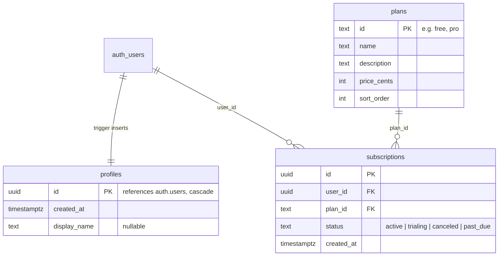
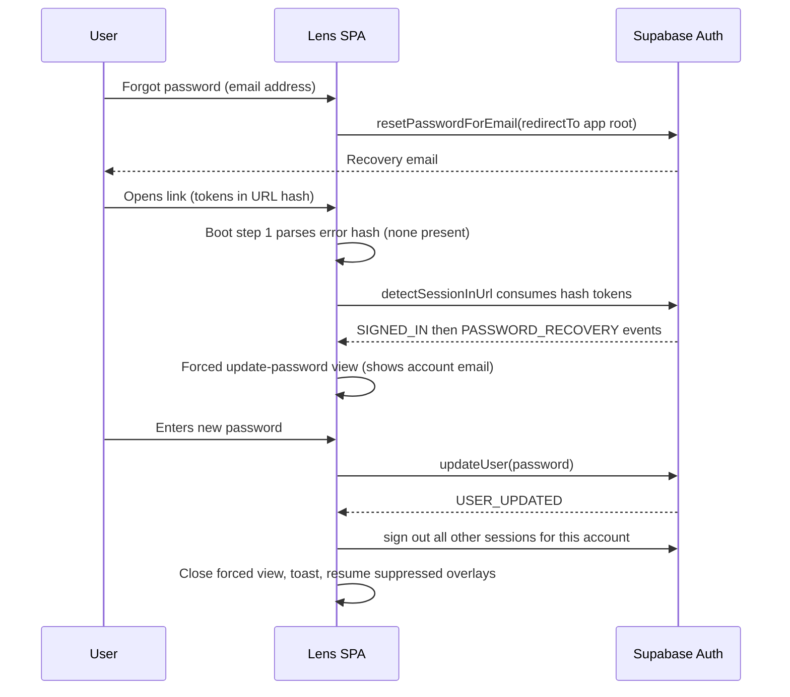
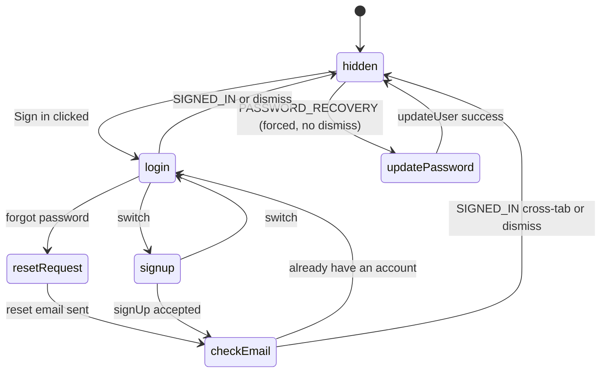

# feat: Supabase auth (sign up, login, password reset) and plan tiers

## Summary

Add a Supabase-backed account layer to Lens: email/password sign up, login, and password reset, plus display-only plan tiers (Free/Pro) with a plans page. Login stays optional — the canvas works logged out exactly as today, and canvas data stays in localStorage. The Supabase project is codified in-repo (config, migrations, seed) so it is reproducible rather than dashboard-only. No payment provider in this pass.

Lens today has no auth, no database, and no client-side env vars; this plan establishes all three conventions for the first time.

---

## Requirements

**Configuration**

- R1. The client connects to Supabase solely via `VITE_SUPABASE_URL` and `VITE_SUPABASE_PUBLISHABLE_KEY`. The publishable key is the only key ever present client-side; no secret key appears in client code, `VITE_`-prefixed vars, or the bundle.
- R2. With either var absent, the app builds and runs exactly as today: auth entry points are hidden, one console warning is emitted, and no Supabase code path executes.
- R3. Supabase project state is codified in-repo: `supabase/config.toml`, versioned SQL migrations, and a seed for plan tiers.
- R4. README documents local setup (Supabase CLI + env vars) and the hosted-project checklist (dashboard settings, Vercel env vars).

**Auth**

- R5. Sign up with email + password, with email confirmation on. After submit, the UI shows a "check your email" state that is identical whether or not the address was already registered, and includes an "already have an account? Sign in" escape.
- R6. Login with email + password. Only `email_not_confirmed` (offer resend) and `over_email_send_rate_limit` (explain the wait) get specific copy; every other failure shows one generic message.
- R7. Sign out returns to anonymous use. No auth transition (sign in, sign out, recovery) touches any `lens.*` localStorage key, with one carve-out: the reserved `lens.auth.*` namespace belongs to auth features and never joins `LENS_STORAGE_KEYS` — "Start fresh" neither clears it nor signs the user out.
- R8. Password reset works end-to-end: request form → recovery email → link lands on the app root → forced update-password view → new password saved, then all other sessions for the account are signed out. The reset-request confirmation state is identical whether or not the address has an account (likewise for resend-confirmation). Expired or used links show guidance branched on link type: recovery links offer a new reset request; signup links offer resend-confirmation and a sign-in option.
- R9. Sessions persist across reloads and tabs. The boot sequence is explicitly ordered so Supabase URL-hash consumption, the auth error-hash parser, and the existing share-link parser never race.
- R10. Resend-confirmation has a 60-second cooldown that survives closing and reopening the auth overlay.

**Plans**

- R11. Plan tiers live in a public-read `plans` table, seeded with Free and Pro.
- R12. Per-user subscription state is readable only by its owner and has no client write path at all — RLS deny-by-default is the enforcement.
- R13. The plans page shows tiers to everyone, signed in or not. Signed-in users see their current plan: no `active`/`trialing` subscription row means Free. A failed subscription fetch hides the plan badge and shows an in-overlay error with retry — it never mislabels a paid user as Free.
- R14. The toolbar shows no account UI until the initial session check resolves; then a "Sign in" affordance (signed out) or the account email + plan badge (signed in).

---

## Key Technical Decisions

- **Plain `@supabase/supabase-js` v2, pinned `^2`, hand-built forms.** `@supabase/auth-ui-react` is unmaintained, `auth-helpers` is deprecated, `@supabase/ssr` is for server-rendered apps only, and supabase-js v3 is pre-release.
- **Implicit flow (the library default), not PKCE.** Lens is a router-less SPA with no server callback. PKCE recovery links only work in the browser that requested the reset (code verifier lives in its localStorage) — a dead end for users who request on desktop and open email on their phone. Implicit-flow tokens arrive in the URL hash and `detectSessionInUrl` consumes them.
- **No router.** Auth and plans render as full-screen overlays driven by App state flags, matching the existing pattern (`ShareWelcomeOverlay`, `Onboarding`, `FunctionEditor` in `client/App.jsx`). Password recovery needs no route: the `PASSWORD_RECOVERY` event flips a flag, so all email redirects target the app root.
- **Session state via a hook module, no React context.** The repo has zero `createContext` usage; App owns all state and passes props. `useSupabaseSession()` is called once from App and its values flow down like everything else.
- **Stripe-ready schema: `plans` + `subscriptions`, where no row = Free.** Signup never writes plan state, so the `handle_new_user` trigger stays trivial (insert profile id only) and plan logic can never block signups. When Stripe arrives, webhooks insert `subscriptions` rows; the shape maps onto the Vercel subscription-starter pattern.
- **Anti-self-upgrade via absent write policies, backed by revoked grants.** Supabase RLS denies by default; `subscriptions` gets a select-own-row policy and nothing else. The migration additionally revokes client-role DML grants on `plans` and `subscriptions` and column-scopes profile updates, so one careless future policy or RLS toggle is not a single point of failure. Only the secret key (server-side, later) can write. Simpler and safer than column-level security as the primary mechanism.
- **Classic versioned migrations, not declarative schemas.** The Supabase CLI's declarative diff tool does not capture policies, grants, or DML — this schema is mostly policies, grants, and seed data.
- **Recovery gate escape is accepted, not fought.** `PASSWORD_RECOVERY` forces the update-password view in that tab for that boot. A refresh or second tab lands signed-in without the gate — acceptable because the user proved email ownership. The forced view names the account email it applies to, so a wrong-account recovery is visible.
- **New API key system.** Use `sb_publishable_...` client-side and reserve `sb_secret_...` for future server work; legacy `anon`/`service_role` keys sunset at the end of 2026.
- **Email confirmations on in both environments.** Hosted projects default to on; `supabase/config.toml` sets `auth.email.enable_confirmations = true` so local flows match (local emails are captured by the CLI's mail viewer, no SMTP needed).

---

## High-Level Technical Design

### Boot sequence

The URL hash is a shared channel: share links (`#share=`), Supabase auth tokens, and auth error codes all arrive there, and `history.replaceState` calls can destroy unconsumed data. Boot order is fixed:

1. Parse the auth error hash synchronously (`error_code`, `type`) before anything else runs; stash the result, do not strip the hash.
2. Supabase client is created at module import (`detectSessionInUrl: true` consumes success tokens from the hash and strips them).
3. `getSession()` resolves initial session state; `onAuthStateChange` subscription starts. Account UI renders nothing until this settles.
4. Existing share-link parse runs after auth hash consumption settles — the current share-import effect fires unconditionally at first mount and must be gated on steps 2-3 completing (its `share`-param strip is otherwise safe).
5. Onboarding check runs last and is suppressed while a forced auth view is active.

### Overlay priority

New overlays join the existing state-flag pattern with explicit stacking rules:

- Forced update-password view > pending share bundle > onboarding. Suppressed overlays show after the forced view resolves.
- The forced update-password view is not scrim-dismissable and traps keyboard events at its root (`stopPropagation`), so canvas key handlers (Escape clears selection, `client/App.jsx` global handler) never fire beneath it. AuthOverlay and PlansOverlay trap keys the same way but keep the scrim-click-dismiss convention.
- Any `SIGNED_IN` event closes AuthOverlay regardless of its internal view (covers cross-tab confirmation), with a toast.

### Data model



RLS: `profiles` select/update own row (`using` and `with check` on `(select auth.uid()) = id`); `plans` select for `anon, authenticated`; `subscriptions` select-own-row only, no write policies. The migration also revokes insert/update/delete from `anon`/`authenticated` on `plans` and `subscriptions`, revokes insert/delete on `profiles`, and column-scopes the profile update grant to `display_name` — the writable surface is policies AND grants, so future columns and tables stay deny-by-default too. `subscriptions.status` carries a CHECK constraint so unexpected values fail at write time, not render time.

`handle_new_user` is `security definer set search_path = ''` and inserts only the profile id. Future profile enrichment must never copy `raw_user_meta_data` into `profiles` without validation — that field is attacker-controlled via signup metadata.

### Password recovery flow



Expired/used links instead land with `#error=access_denied&error_code=otp_expired&type=recovery|signup`; boot step 1 catches this and routes to the branch-specific guidance (R8).

### Auth overlay states



---

## Output Structure

```
supabase/
  config.toml                      # local auth config: site_url, redirect URLs, confirmations on
  migrations/
    <timestamp>_auth_and_plans.sql # profiles, plans, subscriptions, trigger, RLS
  seed.sql                         # Free + Pro plan rows
client/
  lib/
    supabase.js                    # client singleton + readSupabaseConfig(env)
    supabase.test.js
    auth-hash.js                   # pure: parse auth error hash
    auth-hash.test.js
    auth-session.js                # useSupabaseSession hook (getSession + onAuthStateChange)
    auth-errors.js                 # pure: error code -> copy/action mapping, resend cooldown
    auth-errors.test.js
    plans.js                       # pure: effectivePlan(subscriptions, plans)
    plans.test.js
  components/
    AuthOverlay.jsx                # login / signup / resetRequest / checkEmail / updatePassword views
    PlansOverlay.jsx               # tier cards + current plan + upgrade stub
```

The tree is a scope declaration; per-unit `Files` lists are authoritative.

---

## Implementation Units

### U1. Supabase client foundation

- **Goal:** Install supabase-js and establish the client singleton, env-var convention, and unconfigured mode.
- **Requirements:** R1, R2
- **Dependencies:** none
- **Files:** `package.json`, `.env.example`, `client/lib/supabase.js`, `client/lib/supabase.test.js`
- **Approach:** Add `@supabase/supabase-js` pinned `^2`. `client/lib/supabase.js` exports `readSupabaseConfig(env)` (pure: returns `{url, key}` or `null`) and a lazily created singleton guarded by it. Read `import.meta.env` defensively (`import.meta.env?.VITE_SUPABASE_URL`) — the var is absent under `node --test`, and the module must import cleanly there so pure helpers stay testable. When config is null, log one `[lens] Supabase not configured` warning; every auth entry point checks `isSupabaseConfigured()` before rendering. This is the repo's first `import.meta.env` usage — `.env.example` gains the two `VITE_` vars with comments marking them as safe to expose.
- **Patterns to follow:** storage/config helpers in `client/lib/` as kebab-case modules with pure functions separated from I/O (`client/lib/item-history.js`); `[lens]` console prefix.
- **Test scenarios:** `readSupabaseConfig` returns config when both vars present; returns `null` when either or both are missing; returns `null` for empty-string vars. Add the test file to the `test` script in `package.json` (the runner uses an explicit file list).
- **Verification:** `npm test` passes; `npm run dev` with no `VITE_` vars behaves exactly as today with a single console warning.

### U2. Database schema, RLS, and project config

- **Goal:** Codify the Supabase project: schema migration, RLS policies, seed data, and local auth config.
- **Requirements:** R3, R11, R12
- **Dependencies:** none
- **Files:** `supabase/config.toml`, `supabase/migrations/<timestamp>_auth_and_plans.sql`, `supabase/seed.sql`, `.gitignore`
- **Approach:** Single migration creates `profiles`, `plans`, `subscriptions` per the data-model diagram, enables RLS on all three, creates the policies listed there (using the `(select auth.uid())` sub-select form with explicit `to` clauses), applies the grant revocations and the `subscriptions.status` CHECK constraint from the data-model section, and adds the `on_auth_user_created` trigger calling a trivial `handle_new_user` (`security definer set search_path = ''`, inserts profile id only — every other profile column nullable so the trigger can never block signup). Seed inserts Free and Pro rows. `config.toml` (from `supabase init`) sets `auth.site_url = "http://localhost:5173"`, `auth.additional_redirect_urls`, `auth.email.enable_confirmations = true`, `auth.minimum_password_length = 8`, and email link/OTP expiry of at most one hour. Gitignore the CLI's local state (`supabase/.temp`, `supabase/.branches`).
- **Patterns to follow:** canonical Supabase managing-user-data trigger snippet; Vercel subscription-starter table shape (minus Stripe columns).
- **Test scenarios:** `Test expectation: none — SQL and config artifacts; behavior is covered by the verification steps and by U5's derivation tests.`
- **Verification:** `supabase start && supabase db reset` applies migration + seed cleanly; a signup via local Studio creates a `profiles` row automatically; as an authenticated test user, selecting from `plans` returns both tiers, selecting own `subscriptions` works, and inserting/updating a `subscriptions` row is rejected; a second test user cannot read the first user's subscription; updating own `display_name` succeeds while updating own `created_at` is rejected (column-scoped grant); inserting a `subscriptions` row with an unknown status fails the CHECK constraint.

### U3. Session state and boot sequence

- **Goal:** Wire the session lifecycle into App and make the boot order explicit and race-free.
- **Requirements:** R7, R9
- **Dependencies:** U1
- **Files:** `client/lib/auth-session.js`, `client/lib/auth-hash.js`, `client/lib/auth-hash.test.js`, `client/App.jsx`
- **Approach:** `auth-hash.js` exports a pure `parseAuthHashError(hash)` returning `{ errorCode, type }` or `null`. `auth-session.js` exports `useSupabaseSession()`: initial `getSession()`, `onAuthStateChange` subscription (callback kept synchronous — async work inside it can deadlock), returning `{ session, sessionResolved, passwordRecovery, clearPasswordRecovery }`. App calls the hook once and implements the boot sequence from the design section; the error-hash parse result is captured in a module-level constant evaluated before the Supabase client import side-effects. Cross-tab `SIGNED_OUT` is a passive UI swap — never unmounts the canvas, never interrupts editing drafts, in-flight jobs, or an active recording; token-refresh failure gets one toast via the existing `showToast`. "Start fresh" continues to clear only `LENS_STORAGE_KEYS` — the session survives it, and sign-out conversely leaves `lens.*` keys alone.
- **Patterns to follow:** share-link boot parse and hash scrubbing (`client/App.jsx` mount effect, `shared/share-bundle.js`); `useEffect` subscription-with-cleanup.
- **Test scenarios:** `parseAuthHashError` on a recovery-expiry hash returns `{errorCode: "otp_expired", type: "recovery"}`; on a signup-expiry hash returns `type: "signup"`; returns `null` for an empty hash, a `#share=...` hash, and a success-token hash (`#access_token=...` is Supabase's to consume). Covers the parsing half of AE2/AE3.
- **Verification:** manual: sign in, reload — session persists, no account-UI flash before resolution; open a share link while signed in — both the share bundle and the session survive the boot; sign out in tab A while typing in tab B — text and toolbar behave per R7/AE7.

### U4. Auth overlay UI

- **Goal:** Ship the sign up, login, reset-request, check-email, and forced update-password views plus the toolbar account area.
- **Requirements:** R5, R6, R8, R10, R14
- **Dependencies:** U3
- **Files:** `client/components/AuthOverlay.jsx`, `client/components/TopToolbar.jsx`, `client/App.jsx`, `client/styles.css`, `client/lib/auth-errors.js`, `client/lib/auth-errors.test.js`, `package.json`
- **Approach:** `AuthOverlay` implements the state diagram; view state is internal except `updatePassword`, which App forces from the `passwordRecovery` flag (not scrim-dismissable, traps keys, displays the account email). On successful password update, sign out all other sessions for the account — the common reason for a reset is suspected compromise, and the attacker's live session must not survive it. `auth-errors.js` is pure: `describeAuthError(code)` maps `email_not_confirmed` → resend action, `over_email_send_rate_limit` → wait copy, `otp_expired` (+type) → branch guidance, `weak_password`/same-password on update → specific copy, everything else → one generic message; `resendCooldownRemaining(storedAt, now)` computes the 60s cooldown from a `lens.auth.resendAt` localStorage timestamp so overlay close/reopen can't reset it (the cooldown is UX only — the enforcement is Supabase's server-side rate limit, which R6's copy handles). Signup success and already-registered signup render the identical check-email state (Supabase returns an obfuscated user with empty `identities` — do not branch on it); the reset-request and resend confirmations are equally uniform per R8. Password fields validate the 8-character minimum before submit, sourced from one shared constant so client copy and the U2/U6 server settings can't drift. TopToolbar gains an account area per R14, following its existing `MenuDropdown` pattern. Styling uses existing tokens and the `modal-scrim`/`modal` class conventions.
- **Patterns to follow:** overlay components (`client/ShareWelcomeOverlay.jsx`, `Onboarding` in `client/App.jsx`); flat kebab-case classes with feature prefix (`auth-`); `onX` callback prop naming.
- **Test scenarios:** `describeAuthError` returns the resend action for `email_not_confirmed`; wait copy for `over_email_send_rate_limit`; recovery guidance for `otp_expired` + `recovery` (covers AE2); resend + sign-in options for `otp_expired` + `signup` (covers AE3); generic copy for an unknown code. `resendCooldownRemaining`: full cooldown when just stored, partial mid-window, zero after 60s, zero when no timestamp exists. Add the test file to the `test` script.
- **Verification:** manual against local Supabase (CLI mail viewer): full signup → confirm → signed-in flow; signup with an existing email shows the identical check-email state (AE4); login before confirming shows the resend offer — also check whether `email_not_confirmed` surfaces on a wrong-password attempt (if it only appears with correct credentials, the accepted enumeration leak is nil); recovery link forces the update view and Escape/scrim clicks neither dismiss it nor disturb the canvas; completing recovery in browser A signs out the session in browser B (AE9); confirming in a second tab closes the first tab's overlay (AE5).

### U5. Plans data and overlay

- **Goal:** Plans page showing tiers with the signed-in user's current plan, plus the toolbar badge.
- **Requirements:** R13, R14 (badge)
- **Dependencies:** U2, U3
- **Files:** `client/lib/plans.js`, `client/lib/plans.test.js`, `client/components/PlansOverlay.jsx`, `client/components/TopToolbar.jsx`, `client/App.jsx`, `client/styles.css`, `package.json`
- **Approach:** `plans.js` is pure: `effectivePlan(subscriptionRows, plans)` filters to `active`/`trialing`, picks the most recently created row on ties, and resolves the plan by id. Free is the result only for the genuine no-rows case; an unknown `plan_id` or unrecognized `status` yields an indeterminate result the UI treats like a fetch failure (hide badge, show retry) — mislabeling a paying user as Free is the exact failure R13 forbids, and a future webhook writing a new status value must not trigger it. `sortPlans(plans)` orders by `sort_order`. `PlansOverlay` fetches `plans` (works signed out) and, when signed in, own `subscriptions`; fetch failure shows an in-overlay error with retry and suppresses the toolbar badge. Upgrade CTA is a disabled/stub button ("coming soon"). Badge renders only after both session and subscription state resolve.
- **Patterns to follow:** pure-derivation module + colocated test (`client/lib/plans.js` mirrors `client/lib/item-history.js` structure); offline-tolerant fetch handling as in the share flow in `client/App.jsx`.
- **Test scenarios:** no rows → Free; one `active` row → that plan; `trialing` row → that plan; only `canceled`/`past_due` rows → Free; two active rows → most recent `created_at` wins; row with unknown `plan_id` → indeterminate, not Free; row with unrecognized `status` → indeterminate, not Free; `sortPlans` orders by `sort_order`. Covers AE8's derivation half. Add the test file to the `test` script.
- **Verification:** manual: signed out, plans overlay lists both tiers with no badge; signed in with no subscription row shows Free; inserting a Pro row via local Studio shows Pro after reload; with Supabase stopped, the overlay shows the error + retry and no badge appears (AE8).

### U6. Deployment and operational documentation

- **Goal:** Document hosted-project configuration and Vercel wiring so a deploy is reproducible from the repo alone.
- **Requirements:** R4
- **Dependencies:** U1, U2
- **Files:** `README.md`, `.env.example`
- **Approach:** README gains an "Accounts & plans (Supabase)" section: local setup (`supabase start`, `supabase db reset`, env vars), hosted checklist (create project; copy publishable key; Auth → URL Configuration: Site URL = production URL, additional redirect URLs; confirmations on; minimum password length 8; email link/OTP expiry at most one hour), applying migrations (`supabase link`, `supabase db push`, seed), and Vercel env vars (`VITE_` vars are inlined at build time — set them in the Vercel project, and note that a build without them silently ships the auth-less app, which R2's console warning surfaces). The redirect allowlist is a security control, not a config detail: under implicit flow every allowlisted URL can receive live session tokens, so entries are exact URLs in production, the Vercel preview pattern pins the team/project slug as tightly as Supabase's glob syntax allows, and the checklist says to re-audit after any dashboard change (`config.toml` governs local only — hosted settings can silently drift). A prominent callout frames the launch prerequisites as one atomic gate flipped together before the first non-team signup: custom SMTP, CAPTCHA, leaked-password protection, a dashboard auth rate-limit review, a redirect-allowlist audit, and a CSP header — until then, the built-in email service (~2 emails/hour, team members only) is itself the gate keeping outsiders from completing signup.
- **Patterns to follow:** existing README setup section tone and structure.
- **Test scenarios:** `Test expectation: none — documentation only; accuracy is checked by following it during U2/U4 verification.`
- **Verification:** a fresh clone following only the README reaches a working local signup flow; the hosted checklist matches what U2's config.toml encodes.

---

## Acceptance Examples

- AE1. **Recovery happy path.** Given a confirmed user who requested a reset, when they open the emailed link in the same or another browser, then the app boots into the forced update-password view showing their email, and after submitting a new password the view closes and they are signed in.
- AE2. **Expired recovery link.** Given a recovery link older than its validity window, when it is opened, then the app shows "link expired — request a new reset link" with a working path back to the reset-request form, and never the generic error.
- AE3. **Expired or reused signup link.** Given an expired or already-used confirmation link, when it is opened, then the app offers resend-confirmation and a "sign in" option — it does not route into the password-reset flow.
- AE4. **Enumeration-safe signup.** Given an email that already has an account, when someone signs up with it, then the UI shows exactly the same "check your email" state as a fresh signup, plus the "already have an account? Sign in" escape.
- AE5. **Cross-tab confirmation.** Given tab A on the check-email state, when the user confirms in tab B, then tab A closes the auth overlay on the cross-tab `SIGNED_IN` and shows a toast.
- AE6. **Unconfigured mode.** Given a build without the `VITE_` Supabase vars, when the app loads, then no auth or plans entry points render, one console warning appears, and the canvas behaves identically to today.
- AE7. **Cross-tab sign-out while editing.** Given the user is mid-edit in tab B, when tab A signs out, then tab B swaps its toolbar to signed-out state without unmounting the canvas or losing the uncommitted draft.
- AE8. **Subscription fetch failure.** Given a Pro user whose subscriptions query fails, when the toolbar and plans overlay render, then no plan badge appears and the overlay shows an error with retry — the user is never shown "Free".
- AE9. **Recovery revokes other sessions.** Given the account is signed in on browser B, when the user completes password recovery on browser A, then browser B's session is signed out.

---

## Scope Boundaries

### Deferred to Follow-Up Work

- Stripe billing: checkout, customer portal, webhooks, `customers` table. The schema shape is chosen so this lands additively.
- Server-side plan enforcement on AI endpoints (`api/*.js` + `server/index.js`): verify the Supabase JWT via JWKS/`getClaims` and gate by plan. Until then, plans are display-only.
- Syncing canvas data or symbols to Supabase — localStorage remains the source of truth; merge-not-replace rules will need their own plan.
- Social OAuth providers (Google/GitHub).
- The public-launch gate: custom SMTP, CAPTCHA on auth endpoints, leaked-password protection, a dashboard auth rate-limit review, a redirect-allowlist audit, and a CSP header via `vercel.json` — flipped together before the first non-team signup (see Risks), configured operationally rather than in this codebase.
- OTP-code (6-digit) recovery variant for resilience against email-scanner link prefetching.

### Not doing

- Supabase anonymous sign-ins: they create a real `auth.users` row per visitor with no automatic cleanup, and Lens's logged-out mode needs no server data.

---

## Risks & Dependencies

- **Built-in email is dev-only.** Supabase's default SMTP sends ~2 emails/hour and only to project team members' addresses; outside users cannot even receive a confirmation email. Signups beyond the team require custom SMTP first. Mitigation: README callout (U6); testing uses team addresses and the local CLI mail viewer.
- **Email scanners can consume one-time links**, causing `otp_expired` on fresh links (Outlook Safe Links etc.). Mitigation this pass: branch-specific expired-link copy (R8); real fix (OTP-code variant) deferred.
- **Boot-order fragility.** Supabase's hash consumption, the error-hash parser, and the share-link parser share `window.location`; `confirmStartFresh` also rewrites the URL. Mitigation: fixed boot sequence (design section) and a one-time manual check that a combined share-plus-auth boot survives.
- **supabase-js v3 is in pre-release.** Pin `^2`; expect a migration later.
- **A Vercel build missing the `VITE_` vars silently ships the auth-less app.** Accepted per R2 (optional login), surfaced by the console warning and README note.
- **Trigger fragility is designed out, not just mitigated** — `handle_new_user` inserts one column; any future migration touching `profiles` must re-run the U2 signup verification, since a failing trigger blocks all signups with an opaque 500.
- **Login CSRF / session fixation is an accepted risk under implicit flow.** A crafted link carrying an attacker's own valid tokens in the hash signs the victim into the attacker's account via `detectSessionInUrl`. Impact today is negligible because canvas data never leaves localStorage, and the compensating control is visibility — the toolbar shows the account email and `SIGNED_IN` raises a toast (do not later remove that toast as noise). Named revisit trigger: this must be re-evaluated, likely by switching to PKCE or server-mediated auth, before any canvas/symbol sync to Supabase ships.
- **Session tokens live in localStorage; any XSS is full account takeover.** True under implicit and PKCE alike — the flow choice does not change this, which is also why hash-token exposure is a marginal concern next to it (tokens are consumed and stripped, and fragments never reach servers or Referer headers). Mitigation: CSP header + dependency audit sit in the public-launch gate.
- **The redirect-URL allowlist is a token sink under implicit flow.** Any allowlisted URL can receive live access and refresh tokens, so a loose wildcard (an unpinned Vercel preview pattern, a stray `*.vercel.app`) hands out full sessions. Mitigation: U6 treats allowlist hygiene as a security control with a pre-launch audit.
- **`email_not_confirmed` copy is a deliberate, accepted enumeration exception.** R6's resend UX can confirm that an unconfirmed account exists, cutting against AE4's enumeration resistance; the tradeoff is standard and accepted. U4's verification checks whether the error even surfaces on wrong-password attempts — if not, the leak is nil.
- **Scripted signups can burn the email budget before CAPTCHA exists.** The publishable key lets anyone call signup directly; each call creates an unconfirmed user row and consumes the ~2/hour built-in email budget, denying the team its own confirmation emails. Nuisance-level, accepted until the launch gate; the U6 checklist includes a dashboard rate-limit review.

---

## Sources & Research

Repo grounding: overlay/state-flag pattern and global key handling in `client/App.jsx`; share-link hash lifecycle in `shared/share-bundle.js`; localStorage key inventory (`LENS_STORAGE_KEYS`, `lens.*` keys) in `client/App.jsx`; test conventions in `client/lib/item-history.test.js` and the explicit file list in `package.json`.

External (load-bearing for the KTDs above):

- Supabase React quickstart and password auth guides — client setup, `VITE_SUPABASE_PUBLISHABLE_KEY` convention: supabase.com/docs/guides/getting-started/quickstarts/reactjs, /guides/auth/passwords
- Flow semantics — implicit vs PKCE, same-browser PKCE constraint, `PASSWORD_RECOVERY` event: /docs/guides/auth/sessions/implicit-flow, /sessions/pkce-flow, /docs/reference/javascript/auth-resetpasswordforemail
- Profiles trigger canon and its failure modes: /docs/guides/auth/managing-user-data, /docs/guides/troubleshooting/database-error-saving-new-user-RU_EwB
- RLS style (`(select auth.uid())`, explicit `to`, deny-by-default): /docs/guides/database/postgres/row-level-security
- Subscription schema shape: github.com/vercel/nextjs-subscription-payments `schema.sql`
- Email limits and production checklist: /docs/guides/auth/rate-limits, /docs/guides/auth/auth-smtp
- API key migration (`sb_publishable_`/`sb_secret_`, legacy sunset end 2026): /docs/guides/api/api-keys, changelog 29260
- CLI config keys and migrations workflow: /docs/guides/local-development/cli/config, /docs/guides/deployment/database-migrations
